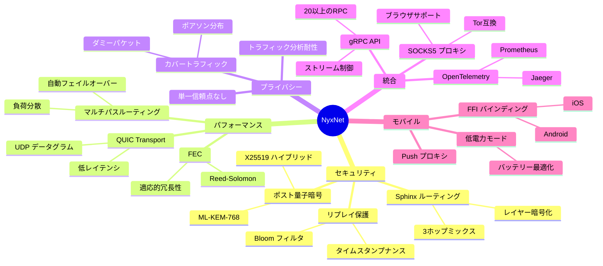
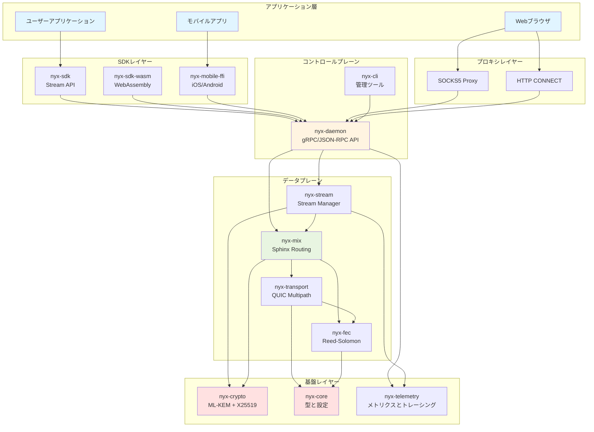
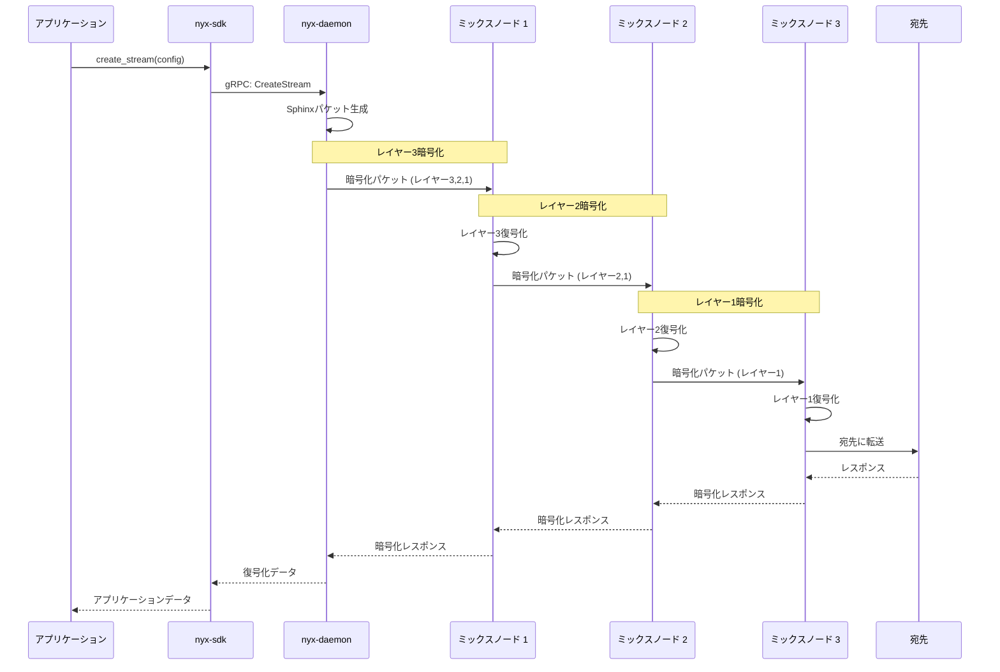
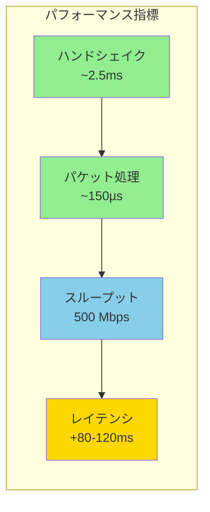
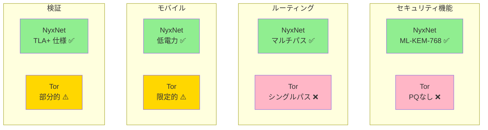
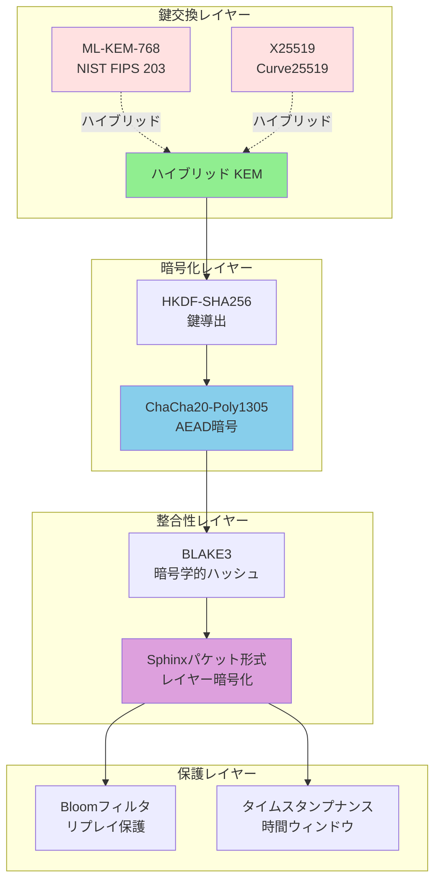
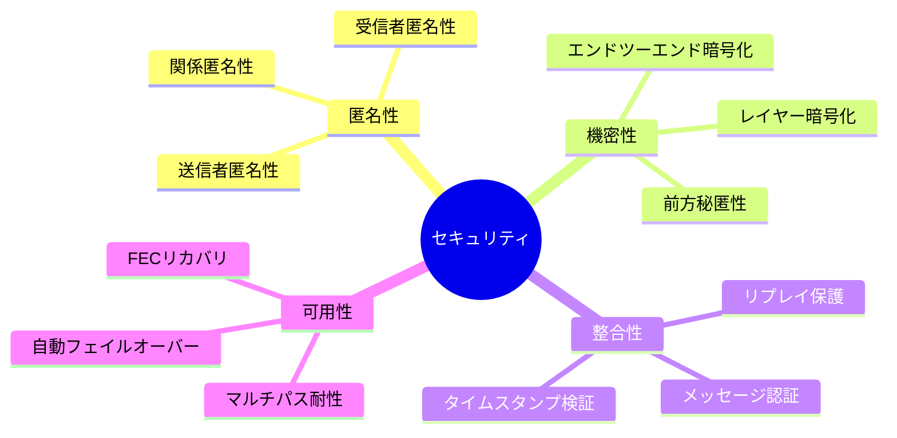
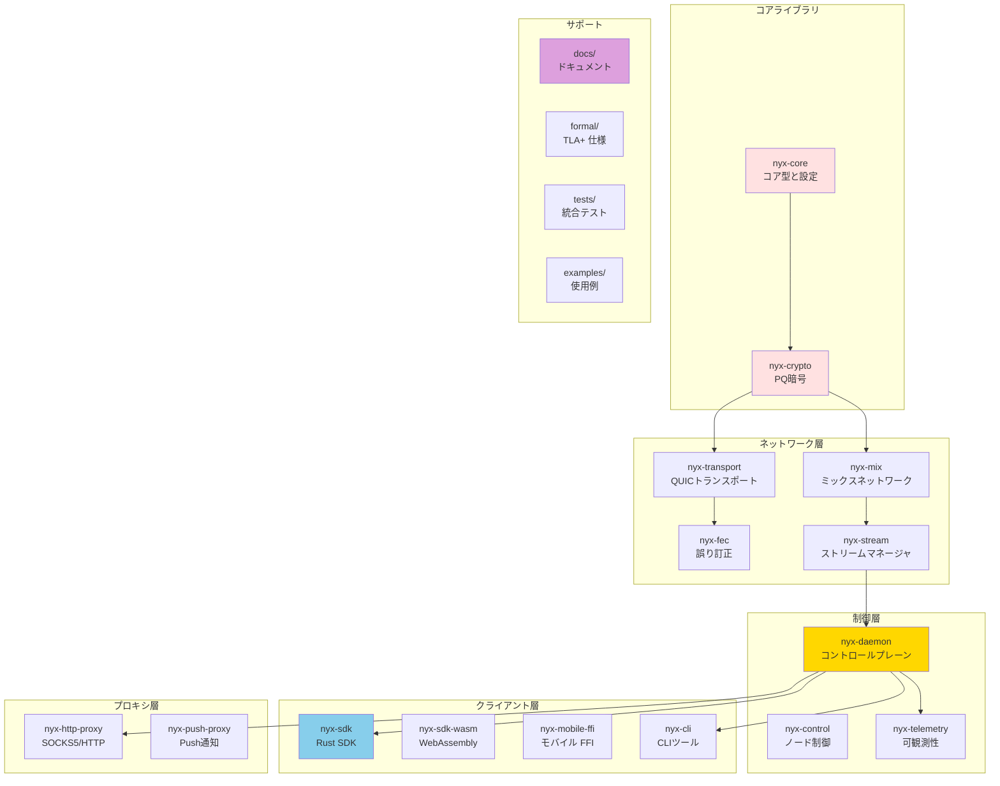

# NyxNet

[](https://opensource.org/licenses/MIT)
[](https://opensource.org/licenses/Apache-2.0)
[](https://www.rust-lang.org/)
[](https://go.dev/)

[](https://github.com/SeleniaProject/NyxNet/actions/workflows/main.yml)
[](https://github.com/SeleniaProject/NyxNet/actions/workflows/security.yml)
[](https://github.com/SeleniaProject/NyxNet/actions/workflows/formal-verification.yml)
[](https://github.com/SeleniaProject/NyxNet/actions/workflows/coverage.yml)

**NyxNet** は、ピュアRustで書かれたプライバシーファースト、ポスト量子セキュアなネットワークスタックです。量子耐性暗号を組み込んだミックスネットワークアーキテクチャを使用して、匿名通信を提供します。量子コンピュータの脅威時代に対応した設計となっています。

[English README is here](README.md)

---

## 目次

- [特徴](#特徴)
- [アーキテクチャ](#アーキテクチャ)
- [クイックスタート](#クイックスタート)
- [インストール](#インストール)
- [使用例](#使用例)
- [ドキュメント](#ドキュメント)
- [パフォーマンス](#パフォーマンス)
- [セキュリティ](#セキュリティ)
- [開発](#開発)
- [貢献](#貢献)
- [ライセンス](#ライセンス)

---

## 特徴

### 🎯 機能マトリックス



### コア機能

| 機能 | 説明 | ステータス |
|------|------|----------|
| **🔐 ポスト量子暗号** | ML-KEM-768（NIST標準化済み）とX25519を使用したハイブリッドハンドシェイク | ✅ 完成 |
| **🧅 Sphinxオニオンルーティング** | レイヤー暗号化による3ホップミックスネットワークによるトラフィック匿名化 | ✅ 完成 |
| **⚡ QUICトランスポート** | UDPデータグラム上の低レイテンシマルチパストランスポート | ✅ 完成 |
| **🛡️ 前方誤り訂正** | Reed-Solomon符号を使用した適応的冗長性制御 | ✅ 完成 |
| **🎛️ gRPC制御API** | ノード管理とストリーム制御のための20以上のRPC | ✅ 完成 |
| **🔒 リプレイ攻撃保護** | Bloomフィルタを使用したタイムスタンプベースのナンス検証 | ✅ 完成 |

### 高度な機能

| 機能 | 説明 | ステータス |
|------|------|----------|
| **🛤️ マルチパスルーティング** | 複数経路での同時通信と自動フェイルオーバー | ✅ 完成 |
| **👻 カバートラフィック** | ポアソン分布に基づく適応的ダミーパケット生成 | ✅ 完成 |
| **🌐 NAT Traversal** | ICE Lite実装によるSTUNサポート | ✅ 完成 |
| **🔄 ホット設定リロード** | ダウンタイムなしの動的設定更新 | ✅ 完成 |
| **🌍 国際化** | Fluent形式のメッセージローカライゼーション | ✅ 完成 |

### 完全機能

| 機能 | 説明 | ステータス |
|------|------|----------|
| **⚙️ cMix統合** | VDF（Verifiable Delay Function）ベースのバッチ処理 | ✅ 完成 |
| **🔌 プラグインフレームワーク** | CBORを使用した動的プロトコル拡張 | ✅ 完成 |
| **🔋 低電力モード** | モバイル環境向けバッテリー最適化 | ✅ 完成 |
| **📊 OpenTelemetry** | OTLP経由のトレーシング・メトリクス（Jaeger/Tempo対応） | ✅ 完成 |
| **☸️ Kubernetesサポート** | Helm charts、HPA、PDB、ServiceMonitor | ✅ 完成 |

### プロキシ機能

| 機能 | 説明 | ステータス |
|------|------|----------|
| **🌐 SOCKS5プロキシ** | RFC 1928準拠、Tor互換 | ✅ 完成 |
| **🌐 HTTP CONNECT** | HTTPSトラフィック用プロキシサポート | ✅ 完成 |
| **🔐 Pure Go TLS** | C/C++依存ゼロのTLS実装 | ✅ 完成 |
| **🦊 ブラウザ統合** | Firefox、Chrome、curl、wget互換 | ✅ 完成 |

---

## アーキテクチャ

NyxNetは、明確な責務分離を持つレイヤードアーキテクチャに従います：



### 主要コンポーネント

| コンポーネント | 説明 | 主な機能 |
|---------------|------|----------|
| **nyx-core** | コアユーティリティ、型、設定 | エラーハンドリング、設定ホットリロード、i18n |
| **nyx-crypto** | ポスト量子暗号 | ML-KEM-768、X25519、ChaCha20-Poly1305、BLAKE3 |
| **nyx-transport** | QUICベーストランスポート層 | マルチパスルーティング、NAT Traversal、UDPデータグラム |
| **nyx-mix** | ミックスネットワーク実装 | Sphinxパケット形式、3ホップルーティング、カバートラフィック |
| **nyx-fec** | 前方誤り訂正 | Reed-Solomon符号、適応的冗長性 |
| **nyx-stream** | ストリーム管理 | 多重化、フロー制御、再接続 |
| **nyx-daemon** | コントロールプレーンデーモン | gRPC API(20以上のRPC)、JSON-RPC 2.0、ノード管理 |
| **nyx-sdk** | クライアントSDK | 高レベルAPI、async/await、エラーリカバリ |
| **nyx-cli** | コマンドラインツール | ノード制御、ストリーム検査、診断 |
| **nyx-http-proxy** | SOCKS5/HTTPプロキシ | Tor互換、pure Go TLS、ブラウザ統合 |

---

## クイックスタート

### 前提条件

- **Rust**: 1.70.0以上（推奨: 1.75以上）
- **Cargo**: 1.70.0以上
- **Go**: 1.21以上（HTTPプロキシ用）
- **Git**: 2.30以上

### ソースからビルド

```bash
# リポジトリをクローン
git clone https://github.com/SeleniaProject/Nyx.git
cd Nyx

# Rustワークスペースをビルド（リリースモード）
cargo build --release

# Go HTTPプロキシをビルド
cd nyx-http-proxy
go build -o nyx-http-proxy
cd ..
```

### デーモンを実行

```bash
# NyxNetデーモンを起動
./target/release/nyx-daemon --config nyx.toml

# 別のターミナルで状態確認
./target/release/nyx-cli status
```

### プロキシを起動

```bash
# localhost:9050でSOCKS5プロキシを起動
./nyx-http-proxy/nyx-http-proxy --socks-port 9050
```

---

## インストール

### ソースから

```bash
# システムワイドにインストール（sudo/admin権限が必要）
cargo install --path nyx-daemon
cargo install --path nyx-cli

# またはtarget/release/から直接バイナリを使用
```

### Dockerを使用

```bash
# Dockerイメージをビルド
docker build -t nyxnet:latest .

# デーモンを実行
docker run -d --name nyx-daemon \
  -p 9050:9050 \
  -v $(pwd)/nyx.toml:/etc/nyx/nyx.toml \
  nyxnet:latest
```

### Kubernetes（Helm）を使用

```bash
# Helmチャートをインストール
helm install nyx ./charts/nyx \
  --namespace nyx-system \
  --create-namespace

# デプロイ状態を確認
kubectl get pods -n nyx-system
```

---

## 使用例

### 通信フロー



### SDKを使用（Rust）

```rust
use nyx_sdk::{DaemonClient, StreamConfig};

#[tokio::main]
async fn main() -> Result<(), Box<dyn std::error::Error>> {
    // ローカルデーモンに接続
    let client = DaemonClient::connect("http://localhost:50051").await?;
    
    // 宛先への匿名ストリームを作成
    let config = StreamConfig {
        destination: "example.com:443".to_string(),
        multipath: true,
        low_power: false,
    };
    
    let mut stream = client.create_stream(config).await?;
    
    // 匿名ネットワーク経由でデータを送信
    stream.write_all(b"GET / HTTP/1.1\r\nHost: example.com\r\n\r\n").await?;
    
    // レスポンスを読み取り
    let mut buffer = vec![0u8; 4096];
    let n = stream.read(&mut buffer).await?;
    println!("{}バイト受信", n);
    
    Ok(())
}
```

### curlでSOCKS5プロキシを使用

```bash
# curlをNyxNet SOCKS5プロキシを使用するように設定
curl --socks5 localhost:9050 https://example.com

# または環境変数を設定
export ALL_PROXY=socks5://localhost:9050
curl https://example.com
```

### Firefoxで使用

1. Firefox設定 → ネットワーク設定を開く
2. 「手動でプロキシを設定する」を選択
3. SOCKSホスト: `localhost`、ポート: `9050`
4. 「SOCKS v5」を選択
5. 「SOCKS v5を使用するときはDNSもプロキシを使用する」にチェック

---

## ドキュメント

包括的なドキュメントは`docs/`ディレクトリにあります：

- [**プロジェクト概要**](docs/01_PROJECT_OVERVIEW.md) - 目標、ユースケース、コンプライアンスレベル
- [**システムアーキテクチャ**](docs/02_SYSTEM_ARCHITECTURE.md) - 詳細なアーキテクチャ設計
- [**主要機能**](docs/03_MAJOR_FEATURES.md) - 詳細な機能説明
- [**APIリファレンス**](docs/04_API_REFERENCE.md) - gRPC/JSON-RPC APIドキュメント
- [**開発セットアップ**](docs/05_DEVELOPMENT_SETUP.md) - 環境セットアップと貢献ガイド

### Torとの比較

Torネットワークとの詳細な比較については、[Tor比較ガイド](docs/ACTUAL_TOR_COMPARISON.md)を参照してください。

### 形式検証

NyxNetは`formal/`ディレクトリにTLA+仕様による形式検証を含んでいます。詳細は[検証ステータス](formal/FINAL_VERIFICATION_STATUS.md)を参照してください。

---

## パフォーマンス

### ベンチマーク



NyxNetは強力なセキュリティ保証と競争力のあるパフォーマンスを実現しています：

| 指標 | 値 | 詳細 |
|------|------|------|
| **ハンドシェイク** | 約2.5ms | ハイブリッドPQハンドシェイク（ML-KEM-768 + X25519） |
| **パケット処理** | 約150µs | パケットあたり（3ホップSphinxルーティング） |
| **スループット** | 最大500 Mbps | FEC有効時のストリームあたり |
| **レイテンシ** | +80-120ms | 直接接続と比較（3ホップミックスネットワーク） |
| **メモリ** | 約50MB | デーモンインスタンスあたり（標準的なワークロード） |
| **CPU** | <5% | 最新CPU上でのストリームあたり |

ローカルでベンチマークを実行：

```bash
# 暗号ベンチマーク
cargo bench -p nyx-crypto

# コアパフォーマンスベンチマーク
cargo bench -p nyx-core --bench security_scalability_benchmark

# 完全統合ベンチマーク
cargo bench -p tests --bench integration_benchmark
```

### Torとの比較



| 指標 | NyxNet | Tor |
|------|--------|-----|
| **ポスト量子セキュリティ** | ✅ ML-KEM-768（NIST標準化） | ❌ 未実装 |
| **マルチパスサポート** | ✅ 自動フェイルオーバー付きネイティブサポート | ❌ シングルパスのみ |
| **モバイル最適化** | ✅ 低電力モード、バッテリー対応 | ⚠️ 限定的な最適化 |
| **形式検証** | ✅ TLA+仕様 | ⚠️ 部分的なカバレッジ |
| **トランスポート** | ✅ QUIC（UDP） | ⚠️ TCPのみ |
| **FEC** | ✅ 適応的Reed-Solomon | ❌ FECなし |
| **言語** | ✅ Pure Rust（メモリ安全） | ⚠️ C（メモリ非安全） |

---

## セキュリティ

### 暗号スタック



### 暗号プリミティブ

| コンポーネント | アルゴリズム | 目的 | 標準 |
|-------------|------------|------|------|
| **鍵交換** | ML-KEM-768 | ポスト量子KEM | NIST FIPS 203 |
| **鍵交換** | X25519 | 古典的ECDH | RFC 7748 |
| **AEAD** | ChaCha20-Poly1305 | 認証付き暗号 | RFC 8439 |
| **ハッシュ** | BLAKE3 | 暗号学的ハッシュ | 高速、安全 |
| **KDF** | HKDF-SHA256 | 鍵導出 | RFC 5869 |
| **パケット形式** | Sphinx | ミックスネットワークルーティング | Mixnet研究 |

### セキュリティ特性



### セキュリティ監査

NyxNetは活発に開発中です。セキュリティ監査レポートは完了次第公開されます。

### 脆弱性の報告

セキュリティの脆弱性は以下に報告してください：**security@selenia-project.org**

セキュリティポリシーについては[SECURITY.md](SECURITY.md)を参照してください。

---

## 開発

### ビルドとテスト

```bash
# すべてのテストを実行
cargo test --workspace --release

# カバレッジ付きでテストを実行
cargo install cargo-tarpaulin
cargo tarpaulin --workspace --out Html

# リンターを実行
cargo clippy --workspace --all-features -- -D warnings

# コードフォーマット
cargo fmt --all -- --check
```

### プロジェクト構造



**ディレクトリレイアウト:**

```
NyxNet/
├── nyx-core/          # コアユーティリティと型
├── nyx-crypto/        # 暗号プリミティブ
├── nyx-transport/     # QUICトランスポート層
├── nyx-mix/           # ミックスネットワーク実装
├── nyx-fec/           # 前方誤り訂正
├── nyx-stream/        # ストリーム管理
├── nyx-daemon/        # コントロールプレーンデーモン
├── nyx-sdk/           # クライアントSDK
├── nyx-cli/           # CLIツール
├── nyx-http-proxy/    # SOCKS5/HTTPプロキシ（Go）
├── docs/              # ドキュメント
├── formal/            # TLA+仕様
├── tests/             # 統合テスト
└── examples/          # 使用例
```

### 貢献

貢献を歓迎します！ガイドラインについては[CONTRIBUTING.md](CONTRIBUTING.md)を参照してください。

1. リポジトリをフォーク
2. 機能ブランチを作成（`git checkout -b feature/amazing-feature`）
3. 変更をコミット（`git commit -m 'Add amazing feature'`）
4. ブランチにプッシュ（`git push origin feature/amazing-feature`）
5. プルリクエストを開く

### 行動規範

このプロジェクトは[行動規範](CODE_OF_CONDUCT.md)に従います。参加することにより、このコードを守ることが期待されます。

---

## ライセンス

NyxNetはデュアルライセンスです：

- **MITライセンス**（[LICENSE-MIT](LICENSE-MIT)またはhttp://opensource.org/licenses/MIT）
- **Apache License, Version 2.0**（[LICENSE-APACHE](LICENSE-APACHE)またはhttp://www.apache.org/licenses/LICENSE-2.0）

目的に応じていずれかのライセンスを選択できます。

---

## 謝辞

NyxNetは以下の研究とプロトコルに基づいて構築されています：

- **Torプロジェクト**: オニオンルーティングの概念
- **Mixnet研究**: Sphinxパケット形式、Loopixタイミング戦略
- **NIST PQC**: ML-KEM標準化
- **Rustコミュニティ**: 優れた暗号ライブラリ

---

## 連絡先

- **プロジェクトウェブサイト**: https://selenia-project.org
- **GitHub**: https://github.com/SeleniaProject/Nyx
- **Email**: contact@selenia-project.org

---

**Selenia Projectチームが❤️を込めて構築**
