# NyxNet

[](https://opensource.org/licenses/MIT)
[](https://opensource.org/licenses/Apache-2.0)
[](https://www.rust-lang.org/)
[](https://go.dev/)

**NyxNet** is a privacy-first, post-quantum secure network stack written in pure Rust. It provides anonymous communication using mix network architecture with built-in quantum-resistant cryptography, designed for the era of quantum computing threats.

[日本語版 README はこちら](README-ja.md)

---

## Table of Contents

- [Features](#features)
- [Architecture](#architecture)
- [Quick Start](#quick-start)
- [Installation](#installation)
- [Usage Examples](#usage-examples)
- [Documentation](#documentation)
- [Performance](#performance)
- [Security](#security)
- [Development](#development)
- [Contributing](#contributing)
- [License](#license)

---

## Features

### 🎯 Feature Matrix


### Core Features

| Feature | Description | Status |
|---------|-------------|--------|
| **🔐 Post-Quantum Cryptography** | Hybrid handshake using ML-KEM-768 (NIST-standardized) and X25519 | ✅ Complete |
| **🧅 Sphinx Onion Routing** | 3-hop mix network with layered encryption for traffic anonymization | ✅ Complete |
| **⚡ QUIC Transport** | Low-latency multipath transport over UDP datagrams | ✅ Complete |
| **🛡️ Forward Error Correction** | Adaptive redundancy control using Reed-Solomon codes | ✅ Complete |
| **🎛️ gRPC Control API** | 20+ RPCs for node management and stream control | ✅ Complete |
| **🔒 Replay Attack Protection** | Timestamp-based nonce verification with Bloom filters | ✅ Complete |

### Advanced Features

| Feature | Description | Status |
|---------|-------------|--------|
| **🛤️ Multipath Routing** | Simultaneous communication over multiple paths with automatic failover | ✅ Complete |
| **👻 Cover Traffic** | Adaptive dummy packet generation based on Poisson distribution | ✅ Complete |
| **🌐 NAT Traversal** | STUN support via ICE Lite implementation | ✅ Complete |
| **🔄 Hot Configuration Reload** | Dynamic configuration updates without downtime | ✅ Complete |
| **🌍 Internationalization** | Fluent-format message localization | ✅ Complete |

### Full Capabilities

| Feature | Description | Status |
|---------|-------------|--------|
| **⚙️ cMix Integration** | VDF (Verifiable Delay Function) based batch processing | ✅ Complete |
| **🔌 Plugin Framework** | Dynamic protocol extension using CBOR | ✅ Complete |
| **🔋 Low Power Mode** | Battery optimization for mobile environments | ✅ Complete |
| **📊 OpenTelemetry** | Tracing and metrics via OTLP (Jaeger/Tempo compatible) | ✅ Complete |
| **☸️ Kubernetes Support** | Helm charts, HPA, PDB, ServiceMonitor | ✅ Complete |

### Proxy Features

| Feature | Description | Status |
|---------|-------------|--------|
| **🌐 SOCKS5 Proxy** | RFC 1928 compliant, Tor-compatible | ✅ Complete |
| **🌐 HTTP CONNECT** | Proxy support for HTTPS traffic | ✅ Complete |
| **🔐 Pure Go TLS** | Zero C/C++ dependency TLS implementation | ✅ Complete |
| **🦊 Browser Integration** | Firefox, Chrome, curl, wget compatible | ✅ Complete |

---

## Architecture

NyxNet follows a layered architecture with clear separation of concerns:


### Key Components

| Component | Description | Key Features |
|-----------|-------------|--------------|
| **nyx-core** | Core utilities, types, configuration | Error handling, config hot-reload, i18n |
| **nyx-crypto** | Post-quantum cryptography | ML-KEM-768, X25519, ChaCha20-Poly1305, BLAKE3 |
| **nyx-transport** | QUIC-based transport layer | Multipath routing, NAT traversal, UDP datagrams |
| **nyx-mix** | Mix network implementation | Sphinx packet format, 3-hop routing, cover traffic |
| **nyx-fec** | Forward Error Correction | Reed-Solomon codes, adaptive redundancy |
| **nyx-stream** | Stream management | Multiplexing, flow control, reconnection |
| **nyx-daemon** | Control plane daemon | gRPC API (20+ RPCs), JSON-RPC 2.0, node management |
| **nyx-sdk** | Client SDK | High-level API, async/await, error recovery |
| **nyx-cli** | Command-line tool | Node control, stream inspection, diagnostics |
| **nyx-http-proxy** | SOCKS5/HTTP proxy | Tor-compatible, pure Go TLS, browser integration |

---

## Quick Start

### Prerequisites

- **Rust**: 1.70.0+ (recommended: 1.75+)
- **Cargo**: 1.70.0+
- **Go**: 1.21+ (for HTTP proxy)
- **Git**: 2.30+

### Build from Source

```bash
# Clone the repository
git clone https://github.com/SeleniaProject/Nyx.git
cd Nyx

# Build Rust workspace (release mode)
cargo build --release

# Build Go HTTP proxy
cd nyx-http-proxy
go build -o nyx-http-proxy
cd ..
```

### Run the Daemon

```bash
# Start the NyxNet daemon
./target/release/nyx-daemon --config nyx.toml

# In another terminal, check status
./target/release/nyx-cli status
```

### Start the Proxy

```bash
# Start SOCKS5 proxy on localhost:9050
./nyx-http-proxy/nyx-http-proxy --socks-port 9050
```

---

## Installation

### From Source

```bash
# Install system-wide (requires sudo/admin)
cargo install --path nyx-daemon
cargo install --path nyx-cli

# Or use the binaries directly from target/release/
```

### Using Docker

```bash
# Build Docker image
docker build -t nyxnet:latest .

# Run daemon
docker run -d --name nyx-daemon \
  -p 9050:9050 \
  -v $(pwd)/nyx.toml:/etc/nyx/nyx.toml \
  nyxnet:latest
```

### Using Kubernetes (Helm)

```bash
# Install Helm chart
helm install nyx ./charts/nyx \
  --namespace nyx-system \
  --create-namespace

# Check deployment status
kubectl get pods -n nyx-system
```

---

## Usage Examples

### Communication Flow


### Using the SDK (Rust)

```rust
use nyx_sdk::{DaemonClient, StreamConfig};

#[tokio::main]
async fn main() -> Result<(), Box<dyn std::error::Error>> {
    // Connect to local daemon
    let client = DaemonClient::connect("http://localhost:50051").await?;
    
    // Create anonymous stream to destination
    let config = StreamConfig {
        destination: "example.com:443".to_string(),
        multipath: true,
        low_power: false,
    };
    
    let mut stream = client.create_stream(config).await?;
    
    // Send data through anonymous network
    stream.write_all(b"GET / HTTP/1.1\r\nHost: example.com\r\n\r\n").await?;
    
    // Read response
    let mut buffer = vec![0u8; 4096];
    let n = stream.read(&mut buffer).await?;
    println!("Received {} bytes", n);
    
    Ok(())
}
```

### Using SOCKS5 Proxy with curl

```bash
# Configure curl to use NyxNet SOCKS5 proxy
curl --socks5 localhost:9050 https://example.com

# Or set environment variable
export ALL_PROXY=socks5://localhost:9050
curl https://example.com
```

### Using with Firefox

1. Open Firefox Settings → Network Settings
2. Select "Manual proxy configuration"
3. SOCKS Host: `localhost`, Port: `9050`
4. Select "SOCKS v5"
5. Check "Proxy DNS when using SOCKS v5"

---

## Documentation

Comprehensive documentation is available in the `docs/` directory:

- [**Project Overview**](docs/01_PROJECT_OVERVIEW.md) - Goals, use cases, and compliance levels
- [**System Architecture**](docs/02_SYSTEM_ARCHITECTURE.md) - Detailed architecture design
- [**Major Features**](docs/03_MAJOR_FEATURES.md) - In-depth feature descriptions
- [**API Reference**](docs/04_API_REFERENCE.md) - gRPC/JSON-RPC API documentation
- [**Development Setup**](docs/05_DEVELOPMENT_SETUP.md) - Environment setup and contribution guide

### Comparison with Tor

See [Tor Comparison Guide](docs/ACTUAL_TOR_COMPARISON.md) for detailed comparison with Tor network.

### Formal Verification

NyxNet includes formal verification using TLA+ specifications in the `formal/` directory. See [Verification Status](formal/FINAL_VERIFICATION_STATUS.md) for details.

---

## Performance

### Benchmarks


NyxNet achieves competitive performance with strong security guarantees:

| Metric | Value | Details |
|--------|-------|---------|
| **Handshake** | ~2.5ms | Hybrid PQ handshake (ML-KEM-768 + X25519) |
| **Packet Processing** | ~150µs | Per packet (3-hop Sphinx routing) |
| **Throughput** | Up to 500 Mbps | Per stream with FEC enabled |
| **Latency** | +80-120ms | vs. direct connection (3-hop mix network) |
| **Memory** | ~50MB | Per daemon instance (typical workload) |
| **CPU** | <5% | Per stream on modern CPU |

Run benchmarks locally:

```bash
# Crypto benchmarks
cargo bench -p nyx-crypto

# Core performance benchmarks
cargo bench -p nyx-core --bench security_scalability_benchmark

# Full integration benchmarks
cargo bench -p tests --bench integration_benchmark
```

### Comparison with Tor



```mermaid
graph TB
    subgraph "Security Features"
        N1[NyxNet<br/>ML-KEM-768 ✅]
        T1[Tor<br/>No PQ ❌]
    end
    
    subgraph "Routing"
        N2[NyxNet<br/>Multipath ✅]
        T2[Tor<br/>Single Path ❌]
    end
    
    subgraph "Mobile"
        N3[NyxNet<br/>Low Power ✅]
        T3[Tor<br/>Limited ⚠️]
    end
    
    subgraph "Verification"
        N4[NyxNet<br/>TLA+ Specs ✅]
        T4[Tor<br/>Partial ⚠️]
    end
    
    style N1 fill:#90EE90
    style N2 fill:#90EE90
    style N3 fill:#90EE90
    style N4 fill:#90EE90
    style T1 fill:#FFB6C6
    style T2 fill:#FFB6C6
    style T3 fill:#FFD700
    style T4 fill:#FFD700
```

| Metric | NyxNet | Tor |
|--------|--------|-----|
| **Post-Quantum Security** | ✅ ML-KEM-768 (NIST standardized) | ❌ Not yet implemented |
| **Multipath Support** | ✅ Native support with auto-failover | ❌ Single path only |
| **Mobile Optimization** | ✅ Low Power Mode, battery-aware | ⚠️ Limited optimization |
| **Formal Verification** | ✅ TLA+ specifications | ⚠️ Partial coverage |
| **Transport** | ✅ QUIC (UDP) | ⚠️ TCP only |
| **FEC** | ✅ Adaptive Reed-Solomon | ❌ No FEC |
| **Language** | ✅ Pure Rust (memory-safe) | ⚠️ C (memory-unsafe) |

---

## Security

### Cryptographic Stack


### Cryptographic Primitives

| Component | Algorithm | Purpose | Standard |
|-----------|-----------|---------|----------|
| **Key Exchange** | ML-KEM-768 | Post-quantum KEM | NIST FIPS 203 |
| **Key Exchange** | X25519 | Classical ECDH | RFC 7748 |
| **AEAD** | ChaCha20-Poly1305 | Authenticated encryption | RFC 8439 |
| **Hash** | BLAKE3 | Cryptographic hash | Fast, secure |
| **KDF** | HKDF-SHA256 | Key derivation | RFC 5869 |
| **Packet Format** | Sphinx | Mix network routing | Mixnet research |

### Security Properties


### Security Audits

NyxNet is under active development. Security audit reports will be published upon completion.

### Reporting Vulnerabilities

Please report security vulnerabilities to: **security@selenia-project.org**

See [SECURITY.md](SECURITY.md) for our security policy.

---

## Development

### Building and Testing

```bash
# Run all tests
cargo test --workspace --release

# Run tests with coverage
cargo install cargo-tarpaulin
cargo tarpaulin --workspace --out Html

# Run linters
cargo clippy --workspace --all-features -- -D warnings

# Format code
cargo fmt --all -- --check
```

### Project Structure


**Directory Layout:**

```
NyxNet/
├── nyx-core/          # Core utilities and types
├── nyx-crypto/        # Cryptographic primitives
├── nyx-transport/     # QUIC transport layer
├── nyx-mix/           # Mix network implementation
├── nyx-fec/           # Forward Error Correction
├── nyx-stream/        # Stream management
├── nyx-daemon/        # Control plane daemon
├── nyx-sdk/           # Client SDK
├── nyx-cli/           # CLI tool
├── nyx-http-proxy/    # SOCKS5/HTTP proxy (Go)
├── docs/              # Documentation
├── formal/            # TLA+ specifications
├── tests/             # Integration tests
└── examples/          # Usage examples
```

### Contributing

We welcome contributions! Please see [CONTRIBUTING.md](CONTRIBUTING.md) for guidelines.

1. Fork the repository
2. Create a feature branch (`git checkout -b feature/amazing-feature`)
3. Commit your changes (`git commit -m 'Add amazing feature'`)
4. Push to the branch (`git push origin feature/amazing-feature`)
5. Open a Pull Request

### Code of Conduct

This project adheres to the [Code of Conduct](CODE_OF_CONDUCT.md). By participating, you are expected to uphold this code.

---

## License

NyxNet is dual-licensed under:

- **MIT License** ([LICENSE-MIT](LICENSE-MIT) or http://opensource.org/licenses/MIT)
- **Apache License, Version 2.0** ([LICENSE-APACHE](LICENSE-APACHE) or http://www.apache.org/licenses/LICENSE-2.0)

You may choose either license for your purposes.

---

## Acknowledgments

NyxNet builds upon research and protocols from:

- **Tor Project**: Onion routing concepts
- **Mixnet Research**: Sphinx packet format, Loopix timing strategy
- **NIST PQC**: ML-KEM standardization
- **Rust Community**: Excellent cryptographic libraries

---

## Contact

- **Project Website**: https://selenia-project.org
- **GitHub**: https://github.com/SeleniaProject/Nyx
- **Email**: contact@selenia-project.org

---

**Built with ❤️ by the Selenia Project team**