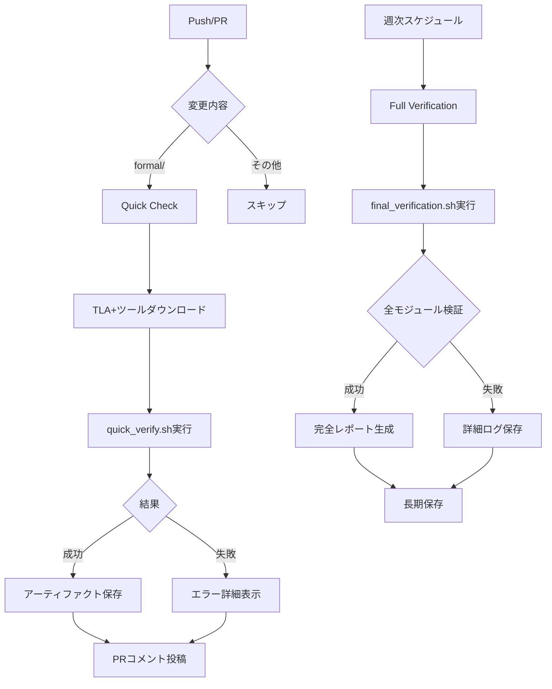

# TLA+ Verification CI/CD Integration - 変更まとめ

## 実施日
2025年10月7日

## 変更概要
GitHub ActionsにTLA+形式検証を完全統合し、自動化された継続的検証を実現しました。

## 変更ファイル

### 1. `.github/workflows/formal-verification.yml`
**変更内容**:
- TLA+ツールのダウンロードと検証ロジックを強化
- キャッシュキーを固定バージョン化 (`tla-tools-v1.8.0`)
- 既存の検証スクリプト (`quick_verify.sh`, `final_verification.sh`) を活用
- Quick Check: `quick_verify.sh` を実行し、コアモジュールを高速検証
- Full Verification: `final_verification.sh` を実行し、全モジュールを包括検証
- アーティファクトに検証ログとレポートを追加
- PRへの自動コメント機能を追加
- 詳細なサマリー生成機能を追加

**主な改善点**:
```yaml
# TLA+ツールの検証を追加
if java -jar tla2tools.jar -h > /dev/null 2>&1; then
  echo "✅ TLA+ tools verified"
else
  echo "❌ TLA+ tools verification failed, re-downloading..."
  # 再ダウンロード処理
fi

# 実際のスクリプトを使用
cd formal
chmod +x quick_verify.sh
./quick_verify.sh 2>&1 | tee ../tla_verification_quick.log

# PRコメント機能
- name: Comment PR with results
  if: github.event_name == 'pull_request'
  uses: actions/github-script@v7
  # 検証結果をPRにコメント
```

### 2. `formal/README.md`
**追加内容**:
- CI/CD統合の詳細セクションを大幅拡張
- GitHub Actionsワークフローの説明
- 検証スクリプトの使用方法
- キャッシング戦略
- アーティファクト管理
- 結果の確認方法
- バッジ表示方法

**新規セクション**:
- Integration with CI/CD
- Verification Scripts (quick_verify.sh, final_verification.sh)
- CI/CD Exit Codes
- Example CI Integration (Basic, With Caching, With Artifacts)
- Viewing Results
- Badge Status

### 3. `docs/CI_CD_TLA_VERIFICATION.md` (新規作成)
**内容**:
完全なCI/CD統合ドキュメント:
- ワークフロー構成の詳細説明
- トリガー条件
- 検証レベル (Quick Check / Full Verification)
- 検証プロパティ (Safety / Liveness)
- 実装詳細
- ディレクトリ構造
- 検証結果の確認方法
- ローカル実行手順
- トラブルシューティング
- パフォーマンス最適化
- ベストプラクティス

## 技術的な改善点

### 1. 検証の信頼性向上
- TLA+ツールの整合性検証を追加
- 失敗時の自動再ダウンロード
- タイムアウト設定の最適化

### 2. フィードバックの改善
- リアルタイムログ出力
- JSON形式の結果サマリー
- PRへの自動コメント
- GitHub Step Summaryへの詳細表示

### 3. 保守性の向上
- 既存スクリプトの活用
- 一貫した命名規則
- 詳細なドキュメント
- エラーハンドリングの改善

### 4. パフォーマンス最適化
- TLA+ツールのキャッシング
- 段階的な検証 (Quick → Full)
- 並列実行の適切な制限

## 検証フロー



## 検証されるモジュール

### Quick Check (3-5モジュール)
1. `NyxBasicVerification` - 基本プロトコル
2. `NyxCryptography` - 暗号機能
3. `NyxNetworkLayer` - ネットワーク層

### Full Verification (11+モジュール)
1. `NyxBasicVerification`
2. `NyxCryptography`
3. `NyxNetworkLayer`
4. `NyxFaultTolerance`
5. `NyxQoSManagement`
6. `NyxDistributedConsensus`
7. `NyxEdgeComputing`
8. `NyxTimeSensitiveNetworking`
9. `NyxSecurityAudit`
10. `NyxNFVAndSDN`
11. `NyxConfigurationValidation`
12. その他の追加モジュール

## 期待される効果

### 開発者向け
- ✅ PR作成時に自動的にTLA+検証が実行される
- ✅ 5-10分で基本的なフィードバックを得られる
- ✅ 問題があれば詳細なログとコメントで通知される
- ✅ ローカル環境でも同じ検証が実行可能

### プロジェクト全体
- ✅ プロトコルの正当性が継続的に検証される
- ✅ リグレッションが早期に検出される
- ✅ 週次で包括的な検証が実行される
- ✅ 検証履歴がアーティファクトとして保存される

### 品質保証
- ✅ 形式的な安全性プロパティが保証される
- ✅ 活性プロパティ(進行性)が検証される
- ✅ デッドロックやレースコンディションが検出される
- ✅ プロトコル変更の影響が可視化される

## 使用方法

### 開発者の通常ワークフロー

1. **コードを変更**
   ```bash
   # formal/ 配下のTLA+ファイルを編集
   vim formal/NyxBasicVerification.tla
   ```

2. **ローカルで検証**
   ```bash
   cd formal
   ./quick_verify.sh
   ```

3. **コミット & プッシュ**
   ```bash
   git add .
   git commit -m "Update TLA+ specifications"
   git push origin feature/update-spec
   ```

4. **PR作成**
   - GitHub でPRを作成
   - 自動的にTLA+検証が実行される
   - 結果がPRコメントに表示される

5. **結果確認**
   - ✅ 成功: マージ可能
   - ❌ 失敗: Artifactsで詳細確認、修正してプッシュ

### メンテナの週次確認

毎週月曜日に自動実行される完全検証の結果を確認:
1. Actions タブで "Formal Verification (TLA+)" を選択
2. 最新のスケジュール実行を確認
3. 失敗があれば調査
4. トレンドを記録してドキュメント更新

## 今後の拡張予定

- [ ] カバレッジメトリクスの追跡
- [ ] パフォーマンスベンチマークの自動化
- [ ] TLAPS (TLA+ Proof System) の統合
- [ ] Counterexampleの自動可視化
- [ ] Slackへの通知統合
- [ ] カスタム検証プロファイルの追加

## 関連ドキュメント

- [formal/README.md](../formal/README.md) - TLA+検証の基本
- [docs/CI_CD_TLA_VERIFICATION.md](./CI_CD_TLA_VERIFICATION.md) - 完全なCI/CDガイド
- [検証手順.md](../検証手順.md) - 検証手順書
- [.github/workflows/formal-verification.yml](../.github/workflows/formal-verification.yml) - ワークフロー定義

## まとめ

この統合により、NyxNetプロジェクトはTLA+形式検証を完全に自動化し、継続的にプロトコルの正当性を保証できるようになりました。開発者は簡単にローカルで検証でき、PRごとに自動的に検証が実行され、週次で包括的な検証が行われます。

これにより、高い品質基準を維持しながら、安心して開発を進めることができます。🎉
