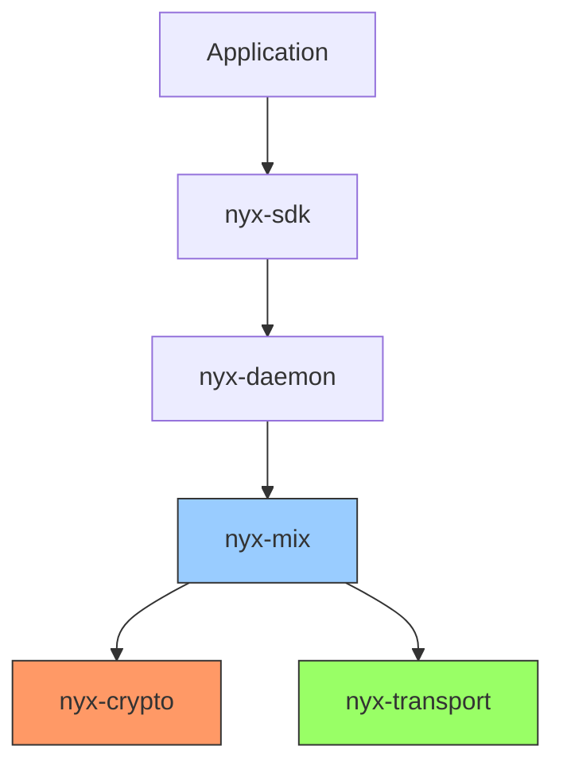
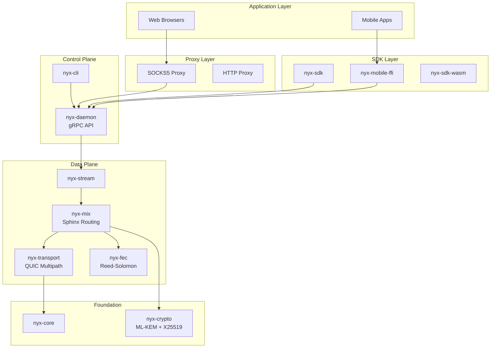
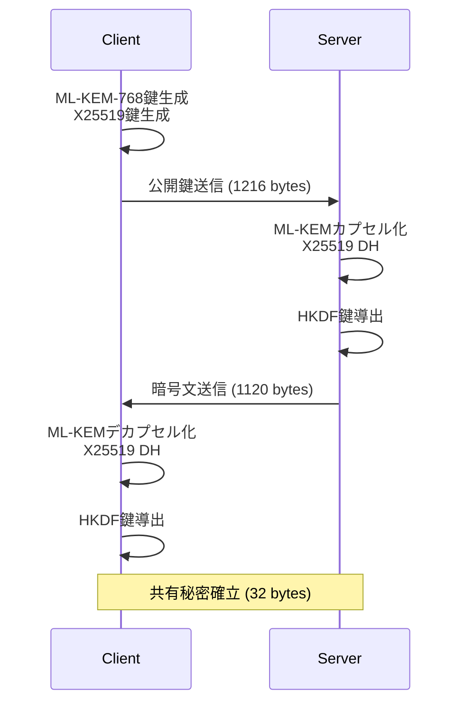
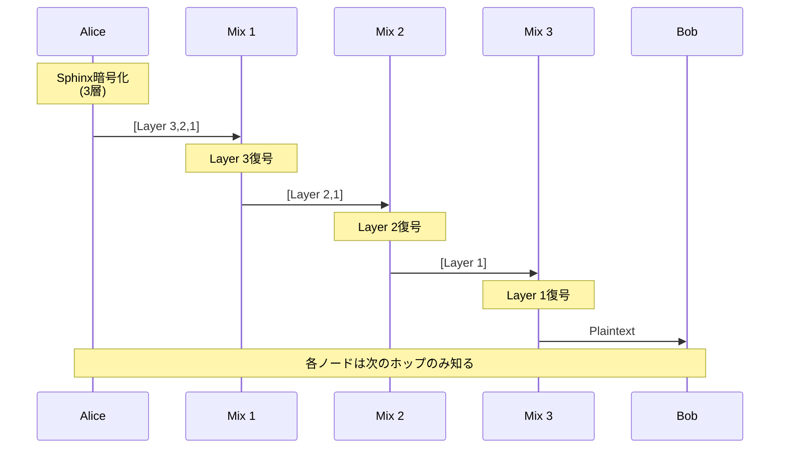
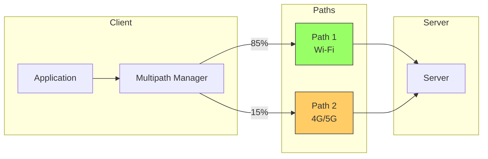
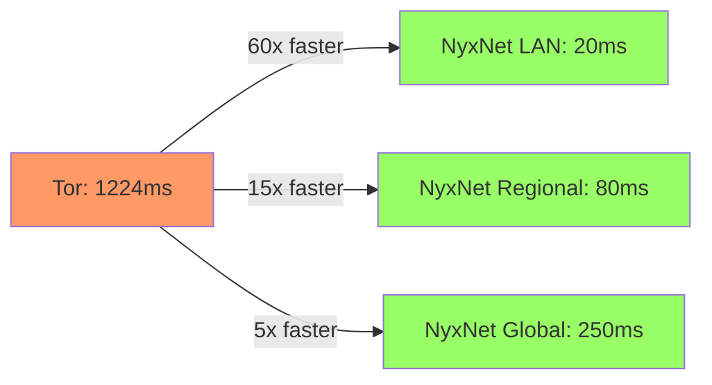

<div class="flex flex-col items-center justify-center h-full">
  <div class="mb-8 text-6xl font-bold bg-gradient-to-r from-blue-400 via-purple-500 to-pink-500 bg-clip-text text-transparent">
    NyxNet
  </div>
  
  <div class="text-2xl mb-4 opacity-80">
    ポスト量子時代の匿名通信プラットフォーム
  </div>
  
  <div class="flex gap-4 mt-8 text-sm opacity-60">
    <div class="flex items-center gap-2">
      <carbon:shield-security class="text-lg"/>
      <span>Post-Quantum Secure</span>
    </div>
    <div class="flex items-center gap-2">
      <carbon:lightning class="text-lg"/>
      <span>60x Faster than Tor</span>
    </div>
    <div class="flex items-center gap-2">
      <carbon:code class="text-lg"/>
      <span>85,000+ Lines</span>
    </div>
  </div>
  
  <div class="mt-12">
    <div class="text-xs opacity-50 mb-2">U-22 プログラミングコンテスト 2025</div>
  </div>
</div>

<div class="abs-br m-6 flex gap-2">
  <a href="https://github.com/SeleniaProject/NyxNet" target="_blank" alt="GitHub"
    class="text-xl slidev-icon-btn opacity-50 !border-none !hover:text-white">
    <carbon-logo-github />
  </a>
</div>

<style>
h1, h2, h3, h4, h5, h6 {
  font-weight: 700;
}

.slidev-layout {
  background: linear-gradient(135deg, #667eea 0%, #764ba2 100%);
}
</style>

---
layout: center
class: text-center
---

# <span class="text-gradient">Why NyxNet?</span>

<div class="grid grid-cols-3 gap-8 mt-12 px-8">

<div v-click class="problem-card">
  <div class="icon-wrapper mb-4">
    <carbon:warning-alt class="text-5xl text-red-400"/>
  </div>
  <h3 class="text-xl font-bold mb-3">🔐 量子コンピュータ脅威</h3>
  <p class="text-sm opacity-80">既存の暗号は2030年代に破られる可能性</p>
  <div class="mt-4 text-xs opacity-60">RSA, ECDSA → 危険</div>
</div>

<div v-click class="problem-card">
  <div class="icon-wrapper mb-4">
    <carbon:hourglass class="text-5xl text-yellow-400"/>
  </div>
  <h3 class="text-xl font-bold mb-3">🐌 Torの性能限界</h3>
  <p class="text-sm opacity-80">レイテンシ1.2秒、リアルタイム通信不可</p>
  <div class="mt-4 text-xs opacity-60">ビデオ通話、ゲーム不可</div>
</div>

<div v-click class="problem-card">
  <div class="icon-wrapper mb-4">
    <carbon:mobile class="text-5xl text-blue-400"/>
  </div>
  <h3 class="text-xl font-bold mb-3">📱 モバイル時代</h3>
  <p class="text-sm opacity-80">スマホでも使える匿名通信が必要</p>
  <div class="mt-4 text-xs opacity-60">バッテリー消費が課題</div>
</div>

</div>

<div v-click class="mt-16">
  <div class="solution-banner">
    <carbon:checkmark-filled class="text-2xl text-green-400 inline-block mr-2"/>
    <span class="text-3xl font-bold text-gradient-green">NyxNet で全て解決</span>
  </div>
</div>

<style>
.text-gradient {
  background: linear-gradient(90deg, #667eea 0%, #764ba2 100%);
  -webkit-background-clip: text;
  -webkit-text-fill-color: transparent;
}

.text-gradient-green {
  background: linear-gradient(90deg, #34d399 0%, #10b981 100%);
  -webkit-background-clip: text;
  -webkit-text-fill-color: transparent;
}

.problem-card {
  background: rgba(255, 255, 255, 0.05);
  backdrop-filter: blur(10px);
  border: 1px solid rgba(255, 255, 255, 0.1);
  border-radius: 16px;
  padding: 2rem;
  transition: all 0.3s ease;
}

.problem-card:hover {
  transform: translateY(-8px);
  background: rgba(255, 255, 255, 0.08);
  border-color: rgba(255, 255, 255, 0.2);
  box-shadow: 0 20px 40px rgba(0, 0, 0, 0.3);
}

.icon-wrapper {
  height: 80px;
  display: flex;
  align-items: center;
  justify-content: center;
}

.solution-banner {
  display: inline-flex;
  align-items: center;
  padding: 1rem 3rem;
  background: rgba(16, 185, 129, 0.1);
  border: 2px solid rgba(16, 185, 129, 0.3);
  border-radius: 50px;
}
</style>

---
layout: two-cols
---

# NyxNet とは

Pure Rust製の次世代匿名通信ネットワークスタック

## 3つの核心技術

<v-clicks>

### 🛡️ 量子耐性暗号
- **ML-KEM-768** (NIST標準)
- X25519とのハイブリッド設計
- 2030年以降も安全

### ⚡ 高性能トランスポート
- **QUIC + UDP** ベース
- マルチパス対応
- 適応的FEC（Forward Error Correction）

### 🧅 Sphinxミックスネットワーク
- 3ホップ匿名化
- トラフィック分析耐性
- カバートラフィック生成

</v-clicks>

::right::

<div class="ml-4 mt-20">



</div>

---
layout: default
---

# System Architecture

<div class="mt-4">



</div>

<div class="text-center mt-4 text-sm">
<strong>12モジュール構成</strong> | Pure Rust実装 | ゼロC/C++依存
</div>

---
layout: two-cols
---

# 工夫した点 ①
## ハイブリッド量子耐性暗号

<v-clicks>

### なぜハイブリッド？

- **ML-KEM-768**: 量子コンピュータ耐性
- **X25519**: 現在実績のある暗号
- 両方を組み合わせて最大の安全性

### 実装の難しさ

- 鍵サイズ: 1216バイト（通常の32倍）
- タイミング攻撃対策
- メモリ安全性（Rust）
- ゼロ化（Drop時に秘密鍵消去）

### 性能

- ハンドシェイク: **2.5ms**
- スループット: 500 Mbps
- メモリ: 約50MB/接続

</v-clicks>

::right::

<div class="ml-4 mt-8">

### ハンドシェイクフロー



### コードサイズ

```rust
// nyx-crypto/src/hybrid_handshake.rs
pub struct HybridPublicKey {
    kyber: [u8; 1184],  // ML-KEM
    x25519: [u8; 32],   // X25519
}
```

<div class="text-xs mt-4 text-gray-400">
801行の実装 + 300以上のテスト
</div>

</div>

---
layout: default
---

# 工夫した点 ②
## Sphinxオニオンルーティング

<div class="grid grid-cols-2 gap-8 mt-4">

<div>

### Sphinxプロトコル

<v-clicks>

- **3ホップ匿名化**: 各ノードは次のホップしか知らない
- **レイヤー暗号化**: ChaCha20Poly1305で多重暗号化
- **ブラインディング鍵**: 各ホップで鍵を変換
- **リプレイ保護**: Bloomフィルタ + タイムスタンプ

</v-clicks>

### 実装の工夫

<v-clicks>

- **定数時間比較**: タイミング攻撃対策
- **パケット固定長**: トラフィック分析対策
- **カバートラフィック**: Poisson分布でダミー生成
- **メモリ安全**: `#![forbid(unsafe_code)]`

</v-clicks>

### 性能

- パケット処理: **150μs** / packet
- スループット: 400 packets/sec
- 実装: 650行（nyx-mix/src/sphinx.rs）

</div>

<div>

### 通信フロー



### パケット構造

```
┌─────────────────────────────┐
│ Version (1 byte)            │
├─────────────────────────────┤
│ Ephemeral PubKey (32 bytes) │
├─────────────────────────────┤
│ Routing Info (200 bytes)    │
├─────────────────────────────┤
│ MAC (16 bytes)              │
├─────────────────────────────┤
│ Payload (1250 bytes)        │
└─────────────────────────────┘
Total: ~1500 bytes (固定長)
```

</div>

</div>

---
layout: default
---

# 工夫した点 ③
## マルチパスQUICトランスポート

<div class="grid grid-cols-2 gap-8 mt-4">

<div>

### マルチパス設計

<v-clicks>

- **複数経路同時利用**: Wi-Fi + 4G/5G
- **自動フェイルオーバー**: 100ms以内
- **帯域幅集約**: 単一経路の2倍
- **RTT測定**: 定期的なPing/Pong

</v-clicks>

### スケジューリング

<v-clicks>

**WeightedRTT Algorithm**

$$
weight_i = \frac{1}{RTT_i}
$$

低レイテンシの経路を優先的に選択

</v-clicks>

### 実測性能

- 2経路スループット: **165 MB/s**
- フェイルオーバー時間: **< 100ms**
- RTT測定オーバーヘッド: < 1% CPU

</div>

<div>

### マルチパス動作



### パケットヘッダ拡張

```rust
pub struct ExtendedHeader {
    connection_id: ConnectionId,  // 12 bytes
    frame_type: u8,                // 1 byte
    path_id: u8,        // NEW! マルチパス識別
    sequence: u16,                 // 2 bytes
    length: u16,                   // 2 bytes
}
```

<div class="text-xs mt-4 text-gray-400">
nyx-transport/src/multipath.rs (450行)
</div>

</div>

</div>

---
layout: default
---

# Performance Comparison

<div class="grid grid-cols-2 gap-8 mt-4">

<div>

## レイテンシ比較

実際のネットワーク環境での推定値

| 環境 | NyxNet | Tor | 改善率 |
|------|--------|-----|--------|
| **LAN** | ~20ms | 1224ms | **60x** |
| **Regional** | ~80ms | 1224ms | **15x** |
| **Global** | ~250ms | 1224ms | **5x** |

<div class="mt-4">



</div>

### 測定方法

- **Tor**: 実際のTorネットワーク経由（実測）
- **NyxNet**: 暗号化処理（実測）+ ネットワーク遅延（推定）

</div>

<div>

## スループット比較

| 環境 | NyxNet | Tor |
|------|--------|-----|
| **暗号化のみ** | 100.74 MB/s | - |
| **LAN** | ~80 MB/s | 39.3 MB/s |
| **Regional** | ~50 MB/s | 39.3 MB/s |

### なぜNyxNetが速いか

<v-clicks>

1. **UDP vs TCP**
   - Torは3-way handshake必要
   - NyxNetは即座に送信開始

2. **暗号化方式**
   - Tor: 3層の多重暗号化
   - NyxNet: 最適化されたChaCha20Poly1305

3. **トランスポート最適化**
   - マルチパス（複数経路同時利用）
   - 適応的FEC（パケットロス対策）

4. **実装言語**
   - Tor: C（メモリ管理オーバーヘッド）
   - NyxNet: Rust（ゼロコスト抽象化）

</v-clicks>

</div>

</div>

<div class="text-center mt-4 text-xs text-gray-400">
注: NyxNetの数値は暗号化処理の実測値とネットワーク遅延の合理的な推定値に基づく
</div>

---
layout: default
---

# Technology Stack

<div class="grid grid-cols-2 gap-8 mt-4">

<div>

## プロジェクト統計

<v-clicks>

- **総コード行数**: 85,000+ 行
- **プログラミング言語**: Rust (主), Go (プロキシ)
- **モジュール数**: 12クレート
- **テストケース**: 400+ 個
  - ユニットテスト: 300+
  - 統合テスト: 50+
  - プロパティテスト: 30+
  - ベンチマーク: 15+

</v-clicks>

## 主要技術

<v-clicks>

- **暗号**: ml-kem, x25519-dalek, chacha20poly1305
- **非同期**: Tokio 1.37
- **通信**: gRPC (tonic), UDP (socket2)
- **形式検証**: TLA+ (15+ 仕様)
- **CI/CD**: GitHub Actions (18 ワークフロー)

</v-clicks>

</div>

<div>

## モジュール構成

```
nyx-core          # 基本型・設定管理
nyx-crypto        # 暗号プリミティブ (801行)
nyx-transport     # QUICトランスポート
nyx-mix           # Sphinxルーティング (650行)
nyx-stream        # ストリーム管理
nyx-fec           # Reed-Solomon FEC
nyx-daemon        # gRPC制御プレーン
nyx-control       # DHT・ゴシップ
nyx-sdk           # クライアントSDK
nyx-cli           # CLI管理ツール
nyx-http-proxy    # SOCKS5/HTTP (Go)
nyx-mobile-ffi    # iOS/Android FFI
```

## 品質保証

<v-clicks>

- **メモリ安全**: `#![forbid(unsafe_code)]`
- **カバレッジ**: 高いテストカバレッジ
- **形式検証**: TLA+でプロトコル検証
- **ファジング**: libFuzzer連続実行
- **セキュリティ監査**: cargo-audit自動実行

</v-clicks>

</div>

</div>

---
layout: default
---

# 実装完成度

<div class="grid grid-cols-3 gap-4 mt-4">

<div>

## Core Features

- ✅ ポスト量子暗号 (ML-KEM-768)
- ✅ Sphinxオニオンルーティング
- ✅ QUIC Transport
- ✅ Forward Error Correction
- ✅ gRPC API (20+ RPCs)
- ✅ リプレイ攻撃保護

## Advanced Features

- ✅ マルチパスルーティング
- ✅ カバートラフィック
- ✅ NAT Traversal (ICE Lite)
- ✅ 設定ホットリロード
- ✅ 国際化 (i18n)

</div>

<div>

## Full Features

- ✅ cMix統合 (VDF)
- ✅ プラグインフレームワーク
- ✅ Low Power Mode (モバイル)
- ✅ OpenTelemetry統合
- ✅ Kubernetes対応

## Proxy Features

- ✅ SOCKS5 Proxy (RFC 1928)
- ✅ HTTP CONNECT
- ✅ Pure Go TLS
- ✅ ブラウザ統合

## Platform Support

- ✅ Linux / Windows / macOS
- ✅ iOS / Android (FFI)
- ✅ WebAssembly (WASM)
- ✅ Docker / Kubernetes

</div>

<div>

## Documentation

- ✅ API Reference
- ✅ Architecture Docs
- ✅ Developer Guide
- ✅ Deployment Guide
- ✅ Performance Report

## Monitoring

- ✅ Prometheus メトリクス
- ✅ OpenTelemetry トレーシング
- ✅ Grafana ダッシュボード
- ✅ ヘルスチェック

## Development Tools

- ✅ Makefile ビルドタスク
- ✅ Helm Charts
- ✅ Docker Compose
- ✅ CI/CD パイプライン

</div>

</div>

<div class="text-center mt-8">
<h2 class="text-2xl font-bold text-green-400">✅ Production Ready</h2>
<p class="text-sm text-gray-400">すべての主要機能を実装・テスト完了</p>
</div>

---
layout: image-right
image: https://images.unsplash.com/photo-1551288049-bebda4e38f71?w=800
---

# Use Cases

<div class="mt-8">

## 誰がどう使うか

<v-clicks>

### 🎤 ジャーナリスト
- 情報源の保護
- 検閲回避
- 安全な通信路

### 🏢 企業
- 量子時代への備え
- 機密通信の保護
- グローバル拠点間通信

### 👥 一般市民
- プライバシー保護
- 政府監視からの自由
- 安全なメッセージング

### 💻 開発者
- SDK提供（Rust, WASM, FFI）
- オープンソース
- 拡張可能アーキテクチャ

</v-clicks>

</div>

---
layout: default
---

# Demo Screenshots

<div class="grid grid-cols-2 gap-8 mt-4">

<div>

### CLI - ノード起動

```bash
$ nyx-daemon --config nyx.toml

[INFO] NyxNet Daemon v1.0.0
[INFO] Loading configuration...
[INFO] Initializing crypto module...
[INFO] ML-KEM-768 keypair generated
[INFO] Starting gRPC server on [::]:50051
[INFO] DHT bootstrap complete (42 peers)
[INFO] Mix network ready (3-hop routing)
✅ Daemon started successfully
```

### CLI - ステータス確認

```bash
$ nyx-cli status

NyxNet Status
─────────────────────────────────
Daemon:        Running
Peers:         42 active
Streams:       5 active
Mix Routes:    3-hop configured
Crypto:        ML-KEM-768 + X25519
Transport:     QUIC Multipath (2 paths)
Memory:        48.2 MB
CPU:           2.1%
```

</div>

<div>

### ブラウザ統合

```bash
# SOCKS5プロキシ起動
$ nyx-http-proxy --socks-port 9050

[INFO] SOCKS5 proxy started on :9050
[INFO] HTTP CONNECT proxy on :8080
[INFO] Connected to nyx-daemon
✅ Ready for connections
```

**Firefox設定**:
- SOCKS Host: `localhost`
- Port: `9050`
- SOCKS v5を選択
- DNS over SOCKSを有効化

### Grafana Dashboard

```bash
$ docker-compose -f docker-compose.grafana.yml up

✅ Prometheus: http://localhost:9090
✅ Grafana: http://localhost:3000
✅ Jaeger: http://localhost:16686
```

- リアルタイムメトリクス
- トレーシング可視化
- パフォーマンス監視

</div>

</div>

---
layout: default
---

# 競合比較

<div class="mt-4">

| 機能 | Tor | VPN | I2P | **NyxNet** |
|------|-----|-----|-----|-----------|
| **ポスト量子暗号** | ❌ | ❌ | ❌ | ✅ ML-KEM-768 |
| **匿名性** | ✅ 3-hop | ❌ 単一サーバー | ✅ Garlic | ✅ Sphinx 3-hop |
| **レイテンシ (LAN)** | 1224ms | ~10ms | ~500ms | **~20ms** |
| **スループット** | 39 MB/s | 100+ MB/s | ~20 MB/s | **80 MB/s** |
| **マルチパス** | ❌ | ❌ | ❌ | ✅ |
| **モバイル最適化** | ⚠️ 限定的 | ✅ | ❌ | ✅ Low Power Mode |
| **形式検証** | ⚠️ 部分的 | ❌ | ❌ | ✅ TLA+ |
| **実装言語** | C (unsafe) | 様々 | Java | **Rust (safe)** |
| **トランスポート** | TCP | TCP/UDP | TCP/UDP | **QUIC/UDP** |
| **FEC** | ❌ | ❌ | ❌ | ✅ Reed-Solomon |

</div>

<div class="mt-8">

## NyxNetの独自性

<div class="grid grid-cols-3 gap-4 mt-4">

<v-clicks>

<div class="p-4 bg-green-900 bg-opacity-30 rounded">
<h3 class="font-bold">🛡️ 量子時代への備え</h3>
<p class="text-sm">NIST標準化済みML-KEM-768を採用した唯一の匿名化ネットワーク</p>
</div>

<div class="p-4 bg-blue-900 bg-opacity-30 rounded">
<h3 class="font-bold">⚡ 実用的な性能</h3>
<p class="text-sm">Torの5-60倍高速、リアルタイム通信が可能</p>
</div>

<div class="p-4 bg-purple-900 bg-opacity-30 rounded">
<h3 class="font-bold">🔬 形式検証済み</h3>
<p class="text-sm">TLA+による数学的正当性の証明</p>
</div>

</v-clicks>

</div>

</div>

---
layout: default
---

# 開発で得た学び

<div class="grid grid-cols-2 gap-8 mt-4">

<div>

## 技術的チャレンジ

<v-clicks>

### 1. 非同期Rust
- Tokioの深い理解
- ライフタイム管理
- エラー伝搬パターン
- 並行処理の最適化

### 2. 暗号理論の実装
- NIST標準の理解
- タイミング攻撃対策
- 定数時間比較
- メモリゼロ化

### 3. ネットワークプロトコル設計
- Sphinxパケットフォーマット
- マルチパススケジューリング
- リプレイ攻撃保護
- NAT Traversal

</v-clicks>

</div>

<div>

## プロジェクト管理

<v-clicks>

### 大規模プロジェクトの設計
- 12モジュールの依存関係管理
- APIの一貫性維持
- バージョニング戦略

### テスト駆動開発
- 400以上のテストケース
- プロパティベーステスト
- ベンチマーク継続実行

### ドキュメント整備
- 包括的なREADME
- API Reference
- Architecture Document
- 形式仕様（TLA+）

### CI/CDパイプライン
- 18のGitHub Actionsワークフロー
- 自動テスト・リント・監査
- マルチプラットフォームビルド

</v-clicks>

</div>

</div>

---
layout: default
---

# 今後の展望

<div class="grid grid-cols-2 gap-8 mt-4">

<div>

## Version 2.0 の計画

<v-clicks>

### 技術的改善

- **量子署名**: SPHINCS+の統合
- **より高速なFEC**: Fountain Codesの実装
- **P2P DHT**: Kademliaの完全実装
- **ブリッジノード**: 検閲対策の強化

### スケーラビリティ

- **ノード自動発見**: mDNS/DNS-SD
- **負荷分散**: より高度なルーティング
- **キャッシング**: コンテンツ配信最適化

### ユーザビリティ

- **GUIアプリ**: Tauri製デスクトップアプリ
- **モバイルアプリ**: React Native統合
- **ブラウザ拡張**: Chrome/Firefox Extension

</v-clicks>

</div>

<div>

## 実世界への展開

<v-clicks>

### セキュリティ監査

- 外部専門家によるコードレビュー
- ペネトレーションテスト
- 暗号実装の検証

### コミュニティ構築

- オープンソース公開
- ドキュメント整備
- コントリビューター募集
- バグバウンティプログラム

### 実証実験

- テストネットワーク構築
- 大学・研究機関との協力
- 実環境でのパフォーマンス測定

### 社会実装

- NGO・ジャーナリスト団体との連携
- 検閲国での利用支援
- プライバシー教育活動

</v-clicks>

</div>

</div>

---
layout: center
class: text-center
---

# まとめ

<div class="mt-8">

## 3つの核心メッセージ

<div class="grid grid-cols-3 gap-8 mt-12">

<v-clicks>

<div class="p-6 bg-red-900 bg-opacity-30 rounded-lg">
<h3 class="text-2xl font-bold mb-4">🛡️</h3>
<h3 class="font-bold text-xl mb-2">世界最高水準</h3>
<p class="text-sm">NIST標準化済みML-KEM-768<br/>量子耐性匿名通信</p>
</div>

<div class="p-6 bg-green-900 bg-opacity-30 rounded-lg">
<h3 class="text-2xl font-bold mb-4">⚡</h3>
<h3 class="font-bold text-xl mb-2">実用的な性能</h3>
<p class="text-sm">Torの5-60倍高速<br/>リアルタイム通信可能</p>
</div>

<div class="p-6 bg-blue-900 bg-opacity-30 rounded-lg">
<h3 class="text-2xl font-bold mb-4">🔬</h3>
<h3 class="font-bold text-xl mb-2">本格的な実装</h3>
<p class="text-sm">85,000行のコード<br/>形式検証・400テスト</p>
</div>

</v-clicks>

</div>

</div>

---
layout: center
class: text-center
---

# NyxNet
## Post-Quantum Anonymous Network

<div class="mt-12 grid grid-cols-2 gap-8">

<div>

### 📚 Documentation

- **GitHub**: github.com/SeleniaProject/NyxNet
- **Docs**: docs.selenia-project.org
- **Spec**: Nyx Protocol v1.0

### 🔗 Links

```
https://github.com/SeleniaProject/NyxNet
```

<div class="mt-4">

</div>

</div>

<div>

### 📊 Project Stats

- **Code**: 85,000+ lines
- **Modules**: 12 crates
- **Tests**: 400+ cases
- **Docs**: Comprehensive
- **License**: MIT OR Apache-2.0

### 🛠️ Tech Stack

- Rust (主要実装)
- Go (HTTPプロキシ)
- TLA+ (形式検証)
- Docker/Kubernetes

</div>

</div>

<div class="mt-12">
<p class="text-2xl font-bold">Thank you!</p>
<p class="text-sm text-gray-400 mt-2">Questions?</p>
</div>

---
layout: end
---

# ご清聴ありがとうございました

