```mermaid {scale: 0.35}
graph TB
    A[Application<br/>アプリケーション]
    B[nyx-sdk<br/>SDK]
    C[nyx-daemon<br/>デーモン]
    D[nyx-mix<br/>ミキシング]
    E[nyx-crypto<br/>暗号化]
    F[nyx-transport<br/>トランスポート]
    
    A --> B
    B --> C
    C --> D
    D --> E
    D --> F
    
    style E fill:#a78bfa,stroke:#7c3aed,stroke-width:3px,color:#fff
    style D fill:#60a5fa,stroke:#2563eb,stroke-width:3px,color:#fff
    style F fill:#34d399,stroke:#10b981,stroke-width:3px,color:#fff
    style A fill:#f472b6,stroke:#ec4899,stroke-width:3px,color:#fff
    style B fill:#fbbf24,stroke:#f59e0b,stroke-width:3px,color:#fff
    style C fill:#fb923c,stroke:#ea580c,stroke-width:3px,color:#fff
```

```mermaid {scale: 0.35}
sequenceDiagram
    participant A as 👤 Alice
    participant M1 as 🔀 Mix 1
    participant M2 as 🔀 Mix 2
    participant M3 as 🔀 Mix 3
    participant B as 👤 Bob
    
    Note over A: 🔐 Sphinx暗号化<br/>(3層)
    A->>M1: [Layer 3,2,1]
    
    Note over M1: 🔓 Layer 3復号
    M1->>M2: [Layer 2,1]
    
    Note over M2: 🔓 Layer 2復号
    M2->>M3: [Layer 1]
    
    Note over M3: 🔓 Layer 1復号
    M3->>B: ✅ Plaintext
    
    Note over A,B: 各ノードは次のホップのみ知る
```

<div class="flex flex-col items-center justify-center h-full">
  <div class="mb-8 text-6xl font-bold bg-gradient-to-r from-blue-400 via-purple-500 to-pink-500 bg-clip-text text-transparent">
    NyxNet
  </div>
  
  <div class="text-2xl mb-4 opacity-80">
    ポスト量子時代の匿名通信プラットフォーム
  </div>
  
  <div class="flex gap-4 mt-8 text-sm opacity-60">
    <div class="flex items-center gap-2">
      <carbon:security class="text-lg"/>
      <span>Post-Quantum Secure</span>
    </div>
    <div class="flex items-center gap-2">
      <carbon:lightning class="text-lg"/>
      <span>60x Faster than Tor</span>
    </div>
    <div class="flex items-center gap-2">
      <carbon:code class="text-lg"/>
      <span>85,000+ Lines</span>
    </div>
  </div>
  
  <div class="mt-12">
    <div class="text-xs opacity-50 mb-2">U-22 プログラミングコンテスト 2025</div>
  </div>
</div>

<div class="abs-br m-6 flex gap-2">
  <a href="https://github.com/SeleniaProject/NyxNet" target="_blank" alt="GitHub"
    class="text-xl slidev-icon-btn opacity-50 !border-none !hover:text-white">
    <carbon:logo-github />
  </a>
</div>

<style>
/* グローバルスタイル - 16:9バランス調整 */
.slidev-layout {
  background: linear-gradient(135deg, #667eea 0%, #764ba2 100%);
  font-size: 0.75rem !important;
  line-height: 1.4 !important;
  padding: 0.8rem 1.5rem !important;
}

h1 { 
  font-size: 1.5rem !important; 
  margin-bottom: 0.3rem !important;
  font-weight: 700;
  line-height: 1.1 !important;
}

h2 { 
  font-size: 1.1rem !important; 
  margin-bottom: 0.25rem !important;
  font-weight: 700;
  line-height: 1.1 !important;
}

h3 { 
  font-size: 0.95rem !important; 
  margin-bottom: 0.2rem !important;
  font-weight: 700;
  line-height: 1.1 !important;
}

h4, h5, h6 {
  font-weight: 700;
  margin-bottom: 0.2rem !important;
  font-size: 0.85rem !important;
}

p {
  margin-bottom: 0.3rem !important;
  line-height: 1.4 !important;
}

ul, ol {
  margin-top: 0.3rem !important;
  margin-bottom: 0.3rem !important;
  padding-left: 1.5rem !important;
}

li {
  margin-bottom: 0.1rem !important;
  line-height: 1.3 !important;
}

code {
  font-size: 0.7rem !important;
  padding: 0.1rem 0.3rem !important;
}

.mt-2 { margin-top: 0.3rem !important; }
.mt-3 { margin-top: 0.5rem !important; }
.mt-4 { margin-top: 0.6rem !important; }
.mt-5 { margin-top: 0.8rem !important; }
.mt-6 { margin-top: 1rem !important; }
.mt-8 { margin-top: 1.2rem !important; }
.mt-12 { margin-top: 1.5rem !important; }
.mb-2 { margin-bottom: 0.3rem !important; }
.mb-3 { margin-bottom: 0.5rem !important; }
.mb-4 { margin-bottom: 0.6rem !important; }
.mb-6 { margin-bottom: 1rem !important; }
.gap-4 { gap: 0.6rem !important; }
.gap-6 { gap: 0.8rem !important; }
.gap-8 { gap: 1rem !important; }
.p-4 { padding: 0.6rem !important; }
.p-6 { padding: 0.8rem !important; }
</style>

---
layout: center
class: text-center
---

# <span class="text-gradient">Why NyxNet?</span>

<div class="grid grid-cols-3 gap-3 mt-2 px-3">

<div v-click class="problem-card">
  <div class="icon-wrapper mb-4">
    <carbon:warning-alt class="text-5xl text-red-400"/>
  </div>
  <h3 class="text-xl font-bold mb-2">🔐 量子脅威</h3>
  <p class="text-sm opacity-80">2030年代に既存暗号が危険</p>
</div>

<div v-click class="problem-card">
  <div class="icon-wrapper mb-4">
    <carbon:hourglass class="text-5xl text-yellow-400"/>
  </div>
  <h3 class="text-xl font-bold mb-2">🐌 Tor遅い</h3>
  <p class="text-sm opacity-80">レイテンシ1.2秒</p>
</div>

<div v-click class="problem-card">
  <div class="icon-wrapper mb-4">
    <carbon:mobile class="text-5xl text-blue-400"/>
  </div>
  <h3 class="text-xl font-bold mb-2">📱 モバイル対応</h3>
  <p class="text-sm opacity-80">スマホで使える匿名通信</p>
</div>

</div>

<div v-click class="mt-16">
  <div class="solution-banner">
    <carbon:checkmark-filled class="text-2xl text-green-400 inline-block mr-2"/>
    <span class="text-3xl font-bold text-gradient-green">NyxNet で全て解決</span>
  </div>
</div>

<style>
.text-gradient {
  background: linear-gradient(90deg, #667eea 0%, #764ba2 100%);
  -webkit-background-clip: text;
  -webkit-text-fill-color: transparent;
}

.text-gradient-green {
  background: linear-gradient(90deg, #34d399 0%, #10b981 100%);
  -webkit-background-clip: text;
  -webkit-text-fill-color: transparent;
}

.problem-card {
  background: rgba(255, 255, 255, 0.05);
  backdrop-filter: blur(10px);
  border: 1px solid rgba(255, 255, 255, 0.1);
  border-radius: 16px;
  padding: 0.8rem;
  transition: all 0.3s ease;
}

.problem-card:hover {
  transform: translateY(-8px);
  background: rgba(255, 255, 255, 0.08);
  border-color: rgba(255, 255, 255, 0.2);
  box-shadow: 0 20px 40px rgba(0, 0, 0, 0.3);
}

.icon-wrapper {
  height: 80px;
  display: flex;
  align-items: center;
  justify-content: center;
}

.solution-banner {
  display: inline-flex;
  align-items: center;
  padding: 0.6rem 2rem;
  background: rgba(16, 185, 129, 0.1);
  border: 2px solid rgba(16, 185, 129, 0.3);
  border-radius: 50px;
}
</style>

---
layout: two-cols
---

# <span class="text-gradient">NyxNet とは</span>

<div class="subtitle mb-4">Pure Rust製の次世代匿名通信ネットワークスタック</div>

## 🔐 核心技術

<v-clicks>

<div class="feature-box mb-4">
  <div class="flex items-center mb-2">
    <carbon:security class="text-2xl text-purple-400 mr-3"/>
    <span class="font-bold text-lg">量子耐性暗号</span>
  </div>
  <ul class="ml-6 text-sm space-y-0 opacity-90">
    <li>ML-KEM-768 (NIST)</li>
    <li>X25519ハイブリッド</li>
  </ul>
</div>

<div class="feature-box mb-4">
  <div class="flex items-center mb-2">
    <carbon:lightning class="text-2xl text-yellow-400 mr-3"/>
    <span class="font-bold text-lg">高性能トランスポート</span>
  </div>
  <ul class="ml-6 text-sm space-y-0 opacity-90">
    <li>QUIC + UDP</li>
    <li>マルチパス対応</li>
  </ul>
</div>

<div class="feature-box mb-4">
  <div class="flex items-center mb-2">
    <carbon:network-3 class="text-2xl text-blue-400 mr-3"/>
    <span class="font-bold text-lg">Sphinxミックスネットワーク</span>
  </div>
  <ul class="ml-6 text-sm space-y-0 opacity-90">
    <li>3ホップ匿名化</li>
    <li>トラフィック分析耐性</li>
  </ul>
</div>

</v-clicks>

::right::

<div class="ml-6">

<div class="arch-title mb-2">
  <carbon:diagram class="inline-block mr-2 text-blue-400"/>
  <span class="font-bold text-lg">システムアーキテクチャ</span>
</div>



<div class="stats-grid mt-8">
  <div class="stat-card">
    <div class="stat-value">12</div>
    <div class="stat-label">モジュール</div>
  </div>
  <div class="stat-card">
    <div class="stat-value">85K+</div>
    <div class="stat-label">コード行数</div>
  </div>
  <div class="stat-card">
    <div class="stat-value">400+</div>
    <div class="stat-label">テスト</div>
  </div>
</div>

</div>

<style>
.subtitle {
  font-size: 0.95rem;
  opacity: 0.75;
  font-weight: 500;
}

.feature-box {
  background: rgba(255, 255, 255, 0.05);
  border-left: 4px solid rgba(167, 139, 250, 0.6);
  padding: 0.6rem;
  border-radius: 10px;
  transition: all 0.3s cubic-bezier(0.4, 0, 0.2, 1);
}

.feature-box:hover {
  background: rgba(255, 255, 255, 0.1);
  border-left-color: rgba(167, 139, 250, 1);
  transform: translateX(6px);
  box-shadow: 0 4px 12px rgba(167, 139, 250, 0.2);
}

.highlight {
  color: #a78bfa;
  font-weight: 700;
}

.arch-title {
  color: #60a5fa;
  font-size: 1.05rem;
}

.stats-grid {
  display: grid;
  grid-template-columns: repeat(3, 1fr);
  gap: 0.75rem;
}

.stat-card {
  text-align: center;
  padding: 1rem 0.5rem;
  background: linear-gradient(135deg, rgba(96, 165, 250, 0.15), rgba(167, 139, 250, 0.15));
  border-radius: 12px;
  border: 1px solid rgba(96, 165, 250, 0.3);
  transition: all 0.3s ease;
}

.stat-card:hover {
  transform: translateY(-4px);
  border-color: rgba(96, 165, 250, 0.6);
  box-shadow: 0 8px 16px rgba(96, 165, 250, 0.2);
}

.stat-value {
  font-size: 1.75rem;
  font-weight: 800;
  background: linear-gradient(135deg, #60a5fa, #a78bfa);
  -webkit-background-clip: text;
  -webkit-text-fill-color: transparent;
}

.stat-label {
  font-size: 0.7rem;
  opacity: 0.7;
  margin-top: 0.25rem;
  font-weight: 500;
}
</style>

---
layout: default
---

# <span class="text-gradient">System Architecture</span>

<div class="arch-subtitle mb-2">レイヤー化された12モジュール構成</div>

<div class="mermaid-container">


</div>

<div class="arch-footer">
  <div class="arch-badge">
    <carbon:cube class="inline-block mr-1"/>
    <strong>12モジュール構成</strong>
  </div>
  <div class="arch-badge">
    <carbon:code class="inline-block mr-1"/>
    <strong>Pure Rust実装</strong>
  </div>
  <div class="arch-badge">
    <carbon:security class="inline-block mr-1"/>
    <strong>ゼロC/C++依存</strong>
  </div>
</div>

<style>
.arch-subtitle {
  text-align: center;
  font-size: 0.95rem;
  opacity: 0.7;
  font-weight: 500;
}

.arch-footer {
  display: flex;
  justify-content: center;
  gap: 0.8rem;
  margin-top: 0.5rem;
  flex-wrap: wrap;
}

.arch-badge {
  display: inline-flex;
  align-items: center;
  padding: 0.3rem 0.8rem;
  background: linear-gradient(135deg, rgba(96, 165, 250, 0.1), rgba(167, 139, 250, 0.1));
  border: 1px solid rgba(96, 165, 250, 0.3);
  border-radius: 20px;
  font-size: 0.75rem;
  transition: all 0.3s ease;
}

.arch-badge:hover {
  background: linear-gradient(135deg, rgba(96, 165, 250, 0.2), rgba(167, 139, 250, 0.2));
  border-color: rgba(96, 165, 250, 0.5);
  transform: translateY(-2px);
}

.mermaid-container {
  max-height: 70vh;
  overflow: hidden;
  display: flex;
  justify-content: center;
  align-items: center;
}
</style>

---
layout: two-cols
---

# <span class="text-gradient">工夫した点 ①</span>
## 🔐 ハイブリッド量子耐性暗号

<v-clicks>

<div class="info-box mb-3">
  <div class="info-title">
    <carbon:help class="inline-block mr-2 text-blue-400"/>
    なぜハイブリッド？
  </div>
  <ul class="info-list">
    <li>ML-KEM-768: 量子耐性</li>
    <li>X25519: 実績あり</li>
  </ul>
</div>

<div class="info-box mb-4">
  <div class="info-title">
    <carbon:warning-alt class="inline-block mr-2 text-yellow-400"/>
    実装の難しさ
  </div>
  <ul class="info-list">
    <li>鍵サイズ: 1216バイト</li>
    <li>タイミング攻撃対策</li>
    <li>メモリゼロ化</li>
  </ul>
</div>

<div class="perf-box">
  <div class="perf-title">
    <carbon:dashboard class="inline-block mr-2 text-green-400"/>
    性能
  </div>
  <div class="perf-grid">
    <div>ハンドシェイク</div><div class="perf-value">2.5ms</div>
    <div>スループット</div><div class="perf-value">500Mbps</div>
  </div>
</div>

</v-clicks>

::right::

<div class="ml-4 mt-2">

<div class="section-title mb-2">
  <carbon:flow class="inline-block mr-2 text-purple-400"/>
  フロー

```mermaid {scale: 0.35}
sequenceDiagram
    participant C as 🖥️ Client
    participant S as 🖥️ Server
    
    C->>C: ML-KEM-768鍵生成<br/>X25519鍵生成
    C->>S: 公開鍵送信 (1216 bytes)
    
    S->>S: ML-KEMカプセル化<br/>X25519 DH
    S->>S: HKDF鍵導出
    S->>C: 暗号文送信 (1120 bytes)
    
    C->>C: ML-KEMデカプセル化<br/>X25519 DH
    C->>C: HKDF鍵導出
    
    Note over C,S: ✅ 共有秘密確立 (32 bytes)
```

</div>



<div class="section-title mb-3 mt-6">
  <carbon:code class="inline-block mr-2 text-blue-400"/>
  コード例
</div>

```rust
// nyx-crypto/src/hybrid_handshake.rs
pub struct HybridPublicKey {
    kyber: [u8; 1184],  // ML-KEM
    x25519: [u8; 32],   // X25519
}
```

<div class="code-stats">
  <carbon:chart-line class="inline-block mr-1"/>
  <strong>801行</strong>の実装 + <strong>300以上</strong>のテスト
</div>

</div>

<style>
.info-box {
  background: rgba(96, 165, 250, 0.08);
  border-left: 4px solid rgba(96, 165, 250, 0.5);
  padding: 0.875rem;
  border-radius: 10px;
}

.info-title {
  font-weight: 700;
  font-size: 0.95rem;
  margin-bottom: 0.5rem;
  display: flex;
  align-items: center;
}

.info-list {
  list-style: none;
  padding-left: 0;
  font-size: 0.875rem;
  line-height: 1.7;
}

.info-list li {
  padding-left: 1.5rem;
  position: relative;
}

.info-list li::before {
  content: "▹";
  position: absolute;
  left: 0.5rem;
  color: #60a5fa;
}

.tech-term {
  color: #a78bfa;
  font-weight: 700;
  font-family: 'Fira Code', monospace;
}

.emphasis {
  color: #34d399;
  font-weight: 700;
}

.perf-box {
  background: linear-gradient(135deg, rgba(16, 185, 129, 0.1), rgba(52, 211, 153, 0.05));
  border: 1px solid rgba(16, 185, 129, 0.3);
  padding: 0.6rem;
  border-radius: 10px;
}

.perf-title {
  font-weight: 700;
  font-size: 0.95rem;
  margin-bottom: 0.5rem;
  display: flex;
  align-items: center;
}

.perf-grid {
  display: grid;
  grid-template-columns: auto 1fr;
  gap: 0.5rem 1rem;
  font-size: 0.875rem;
}

.perf-value {
  color: #34d399;
  font-weight: 700;
  font-family: 'Fira Code', monospace;
}

.section-title {
  font-weight: 700;
  font-size: 1rem;
  display: flex;
  align-items: center;
}

.code-stats {
  background: rgba(96, 165, 250, 0.1);
  padding: 0.5rem 0.75rem;
  border-radius: 8px;
  font-size: 0.8rem;
  margin-top: 0.75rem;
  display: flex;
  align-items: center;
}
</style>

---
layout: default
---

# <span class="text-gradient">工夫した点 ②</span>
## 🧅 Sphinxオニオンルーティング

<div class="grid grid-cols-2 gap-3 mt-2">

<div>

<div class="protocol-section">
  <div class="protocol-header">
    <carbon:layers class="inline-block mr-2 text-purple-400"/>
    <span class="font-bold">Sphinxプロトコル</span>
  </div>

<v-clicks>

  <div class="protocol-item">
    <carbon:network-4 class="inline-block mr-2 text-blue-400"/>
    <strong>3ホップ匿名化</strong>
  </div>
  <div class="protocol-item">
    <carbon:locked class="inline-block mr-2 text-green-400"/>
    <strong>多重暗号化</strong>
  </div>
  <div class="protocol-item">
    <carbon:security class="inline-block mr-2 text-red-400"/>
    <strong>リプレイ保護</strong>
  </div>

</v-clicks>
</div>

<div class="impl-section mt-4">
  <div class="impl-header">
    <carbon:tools class="inline-block mr-2 text-orange-400"/>
    <span class="font-bold">実装の工夫</span>
  </div>

<v-clicks>

  <div class="impl-item">✓ 定数時間比較</div>
  <div class="impl-item">✓ パケット固定長</div>
  <div class="impl-item">✓ メモリ安全</div>

</v-clicks>
</div>

<div class="perf-box-sphinx mt-4">
  <carbon:dashboard class="inline-block mr-2 text-green-400"/>
  <strong>性能:</strong> 
  <span class="perf-highlight">150μs</span>/packet · 
  <span class="perf-highlight">400</span> packets/sec · 
  <span class="perf-highlight">650行</span>実装
</div>

</div>

<div>

<div class="flow-title mb-3">
  <carbon:flow class="inline-block mr-2 text-blue-400"/>
  <strong>通信フロー</strong>
</div>



<div class="packet-title mt-6 mb-3">
  <carbon:document class="inline-block mr-2 text-purple-400"/>
  <strong>パケット構造</strong>
</div>

<div class="packet-structure">
<pre class="packet-pre">
┌─────────────────────────────┐
│ Version (1 byte)            │
├─────────────────────────────┤
│ Ephemeral PubKey (32 bytes) │
├─────────────────────────────┤
│ Routing Info (200 bytes)    │
├─────────────────────────────┤
│ MAC (16 bytes)              │
├─────────────────────────────┤
│ Payload (1250 bytes)        │
└─────────────────────────────┘
</pre>
<div class="packet-total">Total: <span class="highlight-green">~1500 bytes</span> (固定長)</div>
</div>

</div>

</div>

<style>
.protocol-section, .impl-section {
  background: rgba(96, 165, 250, 0.08);
  padding: 1rem;
  border-radius: 12px;
  border: 1px solid rgba(96, 165, 250, 0.2);
}

.protocol-header, .impl-header, .flow-title, .packet-title {
  font-size: 1rem;
  margin-bottom: 0.75rem;
  display: flex;
  align-items: center;
}

.protocol-item, .impl-item {
  font-size: 0.85rem;
  padding: 0.5rem;
  margin: 0.4rem 0;
  background: rgba(255, 255, 255, 0.05);
  border-radius: 6px;
  line-height: 1.5;
}

.perf-box-sphinx {
  background: linear-gradient(135deg, rgba(16, 185, 129, 0.15), rgba(52, 211, 153, 0.08));
  border: 1px solid rgba(16, 185, 129, 0.4);
  padding: 0.875rem;
  border-radius: 10px;
  font-size: 0.875rem;
  display: flex;
  align-items: center;
  flex-wrap: wrap;
}

.perf-highlight {
  color: #34d399;
  font-weight: 800;
  font-family: 'Fira Code', monospace;
}

.code-highlight {
  background: rgba(167, 139, 250, 0.2);
  padding: 0.125rem 0.375rem;
  border-radius: 4px;
  font-family: 'Fira Code', monospace;
  font-size: 0.8rem;
}

.packet-structure {
  background: rgba(0, 0, 0, 0.3);
  padding: 1rem;
  border-radius: 10px;
  border: 1px solid rgba(167, 139, 250, 0.3);
}

.packet-pre {
  font-family: 'Fira Code', monospace;
  font-size: 0.75rem;
  line-height: 1.6;
  color: #a78bfa;
  margin: 0;
}

.packet-total {
  text-align: center;
  margin-top: 0.75rem;
  font-size: 0.85rem;
  font-weight: 600;
}

.highlight-green {
  color: #34d399;
  font-weight: 800;
}
</style>

---
layout: default
---

# <span class="text-gradient">工夫した点 ③</span>
## 🛰️ マルチパスQUICトランスポート

<div class="grid grid-cols-2 gap-3 mt-2">

<div>

<div class="multipath-section">
  <div class="section-header">
    <carbon:network-3 class="inline-block mr-2 text-blue-400"/>
    <span class="font-bold">マルチパス設計</span>
  </div>

<v-clicks>

  <div class="feature-item">
    <carbon:wifi class="inline-block mr-2 text-green-400"/>
    <strong>複数経路同時利用</strong>
  </div>
  <div class="feature-item">
    <carbon:restart class="inline-block mr-2 text-yellow-400"/>
    <strong>自動フェイルオーバー</strong>
  </div>
  <div class="feature-item">
    <carbon:chart-area class="inline-block mr-2 text-purple-400"/>
    <strong>帯域幅集約</strong>
  </div>

</v-clicks>
</div>

<div class="algo-section mt-4">
  <div class="section-header">
    <carbon:result class="inline-block mr-2 text-purple-400"/>
    <span class="font-bold">スケジューリング</span>
  </div>

<v-clicks>

  <div class="algo-box">
    <div class="algo-title">WeightedRTT Algorithm</div>
    <div class="algo-formula">
      $$weight_i = \frac{1}{RTT_i}$$
    </div>
    <div class="algo-desc">
      低レイテンシの経路を優先的に選択
    </div>
  </div>

</v-clicks>
</div>

<div class="perf-metrics mt-4">
  <div class="metric-header">
    <carbon:dashboard class="inline-block mr-2 text-green-400"/>
    <strong>実測性能</strong>
  </div>
  <div class="metric-grid">
    <div>2経路スループット</div>
    <div class="metric-value">165 MB/s</div>
    <div>フェイルオーバー</div>
    <div class="metric-value">&lt; 100ms</div>
    <div>測定オーバーヘッド</div>
    <div class="metric-value">&lt; 1% CPU</div>
  </div>
</div>

</div>

<div>

<div class="diagram-title mb-3">
  <carbon:flow class="inline-block mr-2 text-blue-400"/>
  <strong>マルチパス動作</strong>
</div>


<div class="code-title mt-6 mb-3">
  <carbon:code class="inline-block mr-2 text-purple-400"/>
  <strong>パケットヘッダ拡張</strong>
</div>

<div class="code-box">
```rust
pub struct ExtendedHeader {
    connection_id: ConnectionId, // 12 bytes
    frame_type: u8,               // 1 byte
    path_id: u8,    // ✨ NEW! マルチパス識別
    sequence: u16,                // 2 bytes
    length: u16,                  // 2 bytes
}
```
</div>

<div class="code-meta">
  <carbon:document class="inline-block mr-1"/>
  <code>nyx-transport/src/multipath.rs</code> · <strong>450行</strong>
</div>

</div>

</div>

<style>
.multipath-section, .algo-section, .perf-metrics {
  background: rgba(96, 165, 250, 0.08);
  padding: 1rem;
  border-radius: 12px;
  border: 1px solid rgba(96, 165, 250, 0.25);
}

.section-header, .diagram-title, .code-title {
  font-size: 1rem;
  margin-bottom: 0.75rem;
  display: flex;
  align-items: center;
}

.feature-item {
  font-size: 0.85rem;
  padding: 0.5rem 0.75rem;
  margin: 0.4rem 0;
  background: rgba(255, 255, 255, 0.05);
  border-radius: 8px;
  display: flex;
  align-items: center;
}

.algo-box {
  background: rgba(167, 139, 250, 0.1);
  padding: 1rem;
  border-radius: 10px;
  border: 1px solid rgba(167, 139, 250, 0.3);
}

.algo-title {
  font-weight: 700;
  color: #a78bfa;
  margin-bottom: 0.5rem;
  font-family: 'Fira Code', monospace;
}

.algo-formula {
  text-align: center;
  font-size: 1.25rem;
  margin: 0.75rem 0;
}

.algo-desc {
  font-size: 0.85rem;
  text-align: center;
  opacity: 0.85;
}

.metric-header {
  font-size: 0.95rem;
  margin-bottom: 0.75rem;
  display: flex;
  align-items: center;
}

.metric-grid {
  display: grid;
  grid-template-columns: auto 1fr;
  gap: 0.5rem 1rem;
  font-size: 0.85rem;
}

.metric-value {
  color: #34d399;
  font-weight: 800;
  font-family: 'Fira Code', monospace;
}

.code-box {
  background: rgba(0, 0, 0, 0.3);
  padding: 0.75rem;
  border-radius: 10px;
  border: 1px solid rgba(167, 139, 250, 0.3);
}

.code-meta {
  margin-top: 0.75rem;
  font-size: 0.75rem;
  opacity: 0.7;
  display: flex;
  align-items: center;
}
</style>

---
layout: default
---

# <span class="text-gradient">Performance Comparison</span>
## 📊 NyxNet vs Tor

<div class="grid grid-cols-2 gap-3 mt-2">

<div>

<div class="perf-section">
  <div class="perf-header">
    <carbon:time class="inline-block mr-2 text-blue-400"/>
    <span class="font-bold text-lg">レイテンシ比較</span>
  </div>
  <div class="perf-subtitle">実際のネットワーク環境での推定値</div>

  <div class="comparison-table mt-4">
    <div class="table-row header-row">
      <div>環境</div><div>NyxNet</div><div>Tor</div><div>改善率</div>
    </div>
    <div class="table-row data-row highlight-row">
      <div>🏢 LAN</div>
      <div class="nyx-value">~20ms</div>
      <div class="tor-value">1224ms</div>
      <div class="improve-value">60x</div>
    </div>
    <div class="table-row data-row">
      <div>🌐 Regional</div>
      <div class="nyx-value">~80ms</div>
      <div class="tor-value">1224ms</div>
      <div class="improve-value">15x</div>
    </div>
    <div class="table-row data-row">
      <div>🌍 Global</div>
      <div class="nyx-value">~250ms</div>
      <div class="tor-value">1224ms</div>
      <div class="improve-value">5x</div>
    </div>
  </div>

  <div class="visual-comparison mt-4">
    <div class="compare-bar tor-bar">
      <span class="bar-label">Tor</span>
      <div class="bar-fill tor-fill" style="width: 100%">1224ms</div>
    </div>
    <div class="compare-bar nyx-bar">
      <span class="bar-label">NyxNet LAN</span>
      <div class="bar-fill nyx-fill" style="width: 1.6%">20ms</div>
    </div>
  </div>

  <div class="method-box mt-4">
    <carbon:information class="inline-block mr-2 text-yellow-400"/>
    <strong>測定方法</strong>
    <ul class="method-list">
      <li><strong>Tor</strong>: 実際のTorネットワーク経由（実測）</li>
      <li><strong>NyxNet</strong>: 暗号化処理（実測）+ ネットワーク遅延（推定）</li>
    </ul>
  </div>

</div>

</div>

<div>

<div class="throughput-section">
  <div class="perf-header">
    <carbon:cloud-upload class="inline-block mr-2 text-green-400"/>
    <span class="font-bold text-lg">スループット比較</span>
  </div>

  <div class="throughput-table mt-4">
    <div class="table-row header-row">
      <div>環境</div><div>NyxNet</div><div>Tor</div>
    </div>
    <div class="table-row data-row">
      <div>⚡ 暗号化のみ</div>
      <div class="nyx-value">100.74 MB/s</div>
      <div class="tor-value">-</div>
    </div>
    <div class="table-row data-row highlight-row">
      <div>🏢 LAN</div>
      <div class="nyx-value">~80 MB/s</div>
      <div class="tor-value">39.3 MB/s</div>
    </div>
    <div class="table-row data-row">
      <div>🌐 Regional</div>
      <div class="nyx-value">~50 MB/s</div>
      <div class="tor-value">39.3 MB/s</div>
    </div>
  </div>

  <div class="reason-box mt-4">
    <div class="reason-title">
      <carbon:lightning class="inline-block mr-2 text-yellow-400"/>
      <strong>なぜNyxNetが速いか</strong>
    </div>

<v-clicks>

    <div class="reason-item">
      <span class="reason-number">1</span>
      <div class="reason-content">
        <strong>UDP vs TCP</strong>
        <div class="reason-detail">Torは3-way handshake必要 → NyxNetは即座に送信開始</div>
      </div>
    </div>

    <div class="reason-item">
      <span class="reason-number">2</span>
      <div class="reason-content">
        <strong>暗号化方式</strong>
        <div class="reason-detail">最適化されたChaCha20Poly1305</div>
      </div>
    </div>

    <div class="reason-item">
      <span class="reason-number">3</span>
      <div class="reason-content">
        <strong>トランスポート最適化</strong>
        <div class="reason-detail">マルチパス + 適応的FEC</div>
      </div>
    </div>

    <div class="reason-item">
      <span class="reason-number">4</span>
      <div class="reason-content">
        <strong>実装言語</strong>
        <div class="reason-detail">Rust（ゼロコスト抽象化）</div>
      </div>
    </div>

</v-clicks>

  </div>

</div>

</div>

</div>

<div class="disclaimer">
  <carbon:warning-alt class="inline-block mr-1"/>
  注: NyxNetの数値は暗号化処理の実測値とネットワーク遅延の合理的な推定値に基づく
</div>

<style>
.perf-section, .throughput-section {
  background: rgba(96, 165, 250, 0.08);
  padding: 1.25rem;
  border-radius: 14px;
  border: 1px solid rgba(96, 165, 250, 0.25);
}

.perf-header {
  display: flex;
  align-items: center;
  margin-bottom: 0.25rem;
}

.perf-subtitle {
  font-size: 0.8rem;
  opacity: 0.7;
  margin-bottom: 0.5rem;
}

.comparison-table, .throughput-table {
  background: rgba(0, 0, 0, 0.2);
  border-radius: 10px;
  overflow: hidden;
}

.table-row {
  display: grid;
  grid-template-columns: 1.2fr 1fr 1fr 0.8fr;
  gap: 0.5rem;
  padding: 0.5rem 0.75rem;
  font-size: 0.85rem;
}

.throughput-table .table-row {
  grid-template-columns: 1.5fr 1fr 1fr;
}

.header-row {
  background: rgba(96, 165, 250, 0.2);
  font-weight: 700;
}

.data-row {
  border-top: 1px solid rgba(255, 255, 255, 0.05);
}

.highlight-row {
  background: rgba(52, 211, 153, 0.08);
}

.nyx-value {
  color: #34d399;
  font-weight: 700;
  font-family: 'Fira Code', monospace;
}

.tor-value {
  color: #ef4444;
  font-weight: 600;
  font-family: 'Fira Code', monospace;
}

.improve-value {
  color: #fbbf24;
  font-weight: 800;
  font-family: 'Fira Code', monospace;
}

.visual-comparison {
  background: rgba(0, 0, 0, 0.2);
  padding: 1rem;
  border-radius: 10px;
}

.compare-bar {
  margin: 0.5rem 0;
}

.bar-label {
  font-size: 0.75rem;
  font-weight: 600;
  display: block;
  margin-bottom: 0.25rem;
}

.bar-fill {
  padding: 0.4rem 0.75rem;
  border-radius: 6px;
  font-size: 0.75rem;
  font-weight: 700;
  font-family: 'Fira Code', monospace;
}

.tor-fill {
  background: linear-gradient(90deg, #ef4444, #dc2626);
}

.nyx-fill {
  background: linear-gradient(90deg, #34d399, #10b981);
}

.method-box {
  background: rgba(251, 191, 36, 0.1);
  border: 1px solid rgba(251, 191, 36, 0.3);
  padding: 0.75rem;
  border-radius: 8px;
  font-size: 0.8rem;
}

.method-list {
  margin-top: 0.5rem;
  margin-left: 1.5rem;
  font-size: 0.75rem;
  line-height: 1.6;
}

.reason-box {
  background: rgba(0, 0, 0, 0.2);
  padding: 1rem;
  border-radius: 10px;
}

.reason-title {
  font-size: 0.95rem;
  margin-bottom: 0.75rem;
  display: flex;
  align-items: center;
}

.reason-item {
  display: flex;
  gap: 0.75rem;
  margin: 0.5rem 0;
  padding: 0.5rem;
  background: rgba(255, 255, 255, 0.05);
  border-radius: 8px;
}

.reason-number {
  flex-shrink: 0;
  width: 1.75rem;
  height: 1.75rem;
  background: linear-gradient(135deg, #60a5fa, #a78bfa);
  border-radius: 50%;
  display: flex;
  align-items: center;
  justify-content: center;
  font-weight: 800;
  font-size: 0.85rem;
}

.reason-content {
  flex: 1;
  font-size: 0.8rem;
}

.reason-content strong {
  display: block;
  margin-bottom: 0.125rem;
  color: #60a5fa;
}

.reason-detail {
  font-size: 0.75rem;
  opacity: 0.85;
}

.disclaimer {
  text-align: center;
  margin-top: 1.5rem;
  font-size: 0.75rem;
  opacity: 0.6;
  display: flex;
  align-items: center;
  justify-content: center;
}
</style>

---
layout: default
---

# <span class="text-gradient">Technology Stack</span>
## ☁️ 技術スタックと品質保証

<div class="grid grid-cols-2 gap-3 mt-2">

<div>

<div class="stats-section">
  <div class="stats-header">
    <carbon:analytics class="inline-block mr-2 text-blue-400"/>
    <span class="font-bold text-lg">プロジェクト統計</span>
  </div>

<v-clicks>

  <div class="stat-item-large">
    <carbon:code class="stat-icon text-green-400"/>
    <div class="stat-content">
      <div class="stat-label">コード</div>
      <div class="stat-value-large">85K+</div>
    </div>
  </div>

  <div class="stat-item-large">
    <carbon:cube class="stat-icon text-purple-400"/>
    <div class="stat-content">
      <div class="stat-label">モジュール</div>
      <div class="stat-value-large">12</div>
    </div>
  </div>

  <div class="stat-item-large">
    <carbon:analytics class="stat-icon text-yellow-400"/>
    <div class="stat-content">
      <div class="stat-label">テスト</div>
      <div class="stat-value-large">400+</div>
    </div>
  </div>

</v-clicks>

</div>

<div class="tech-section mt-4">
  <div class="tech-header">
    <carbon:categories class="inline-block mr-2 text-green-400"/>
    <span class="font-bold text-lg">主要技術</span>
  </div>

<v-clicks>

  <div class="tech-category">
    <carbon:locked class="inline-block mr-2 text-purple-400"/>
    <strong>暗号:</strong> ML-KEM · X25519
  </div>

  <div class="tech-category">
    <carbon:repeat class="inline-block mr-2 text-blue-400"/>
    <strong>非同期:</strong> Tokio
  </div>

  <div class="tech-category">
    <carbon:checkmark class="inline-block mr-2 text-yellow-400"/>
    <strong>検証:</strong> TLA+
  </div>

</v-clicks>

</div>

</div>

<div>

<div class="modules-section">
  <div class="modules-header">
    <carbon:list class="inline-block mr-2 text-blue-400"/>
    <span class="font-bold text-lg">モジュール構成</span>
  </div>

  <div class="modules-tree">
```
nyx-core        # 基本型
nyx-crypto      # 暗号
nyx-transport   # QUIC
nyx-mix         # Sphinx
nyx-stream      # ストリーム
nyx-daemon      # gRPC
nyx-sdk         # SDK
nyx-cli         # CLI
```
  </div>
</div>

<div class="quality-section mt-4">
  <div class="quality-header">
    <carbon:security class="inline-block mr-2 text-red-400"/>
    <span class="font-bold text-lg">品質保証</span>
  </div>

<v-clicks>

  <div class="quality-item">
    <carbon:locked class="quality-icon text-purple-400"/>
    <div class="quality-content">
      <strong>メモリ安全</strong>
      <code class="quality-code">#![forbid(unsafe_code)]</code>
    </div>
  </div>

  <div class="quality-item">
    <carbon:rule class="quality-icon text-blue-400"/>
    <div class="quality-content">
      <strong>形式検証</strong>
      <span class="quality-desc">TLA+</span>
    </div>
  </div>

  <div class="quality-item">
    <carbon:warning-hex class="quality-icon text-yellow-400"/>
    <div class="quality-content">
      <strong>ファジング</strong>
      <span class="quality-desc">libFuzzer</span>
    </div>
  </div>

</v-clicks>

</div>

</div>

</div>

<style>
.stats-section, .tech-section, .modules-section, .quality-section {
  background: rgba(96, 165, 250, 0.08);
  padding: 0.8rem;
  border-radius: 12px;
  border: 1px solid rgba(96, 165, 250, 0.25);
}

.stats-header, .tech-header, .modules-header, .quality-header {
  display: flex;
  align-items: center;
  margin-bottom: 0.6rem;
}

.stat-item-large {
  display: flex;
  align-items: center;
  gap: 0.6rem;
  padding: 0.6rem;
  margin: 0.3rem 0;
  background: linear-gradient(135deg, rgba(96, 165, 250, 0.1), rgba(167, 139, 250, 0.1));
  border-radius: 10px;
  border: 1px solid rgba(96, 165, 250, 0.2);
}

.stat-icon {
  font-size: 1.3rem;
}

.stat-content {
  flex: 1;
}

.stat-label {
  font-size: 0.75rem;
  opacity: 0.7;
  margin-bottom: 0.125rem;
}

.stat-value-large {
  font-size: 1.1rem;
  font-weight: 800;
  background: linear-gradient(135deg, #60a5fa, #a78bfa);
  -webkit-background-clip: text;
  -webkit-text-fill-color: transparent;
  font-family: 'Fira Code', monospace;
}

.test-breakdown {
  background: rgba(251, 191, 36, 0.1);
  border: 1px solid rgba(251, 191, 36, 0.3);
  padding: 0.875rem;
  border-radius: 10px;
  font-size: 0.85rem;
  margin-top: 0.75rem;
}

.test-list {
  margin-top: 0.5rem;
  margin-left: 1.75rem;
  font-size: 0.75rem;
  line-height: 1.7;
}

.tech-category {
  padding: 0.625rem 0.875rem;
  margin: 0.4rem 0;
  background: rgba(255, 255, 255, 0.05);
  border-radius: 8px;
  font-size: 0.85rem;
  display: flex;
  align-items: center;
}

.modules-tree {
  background: rgba(0, 0, 0, 0.3);
  padding: 1rem;
  border-radius: 10px;
  font-family: 'Fira Code', monospace;
  font-size: 0.8rem;
  line-height: 1.8;
  overflow-x: auto;
}

.module-name {
  color: #60a5fa;
  font-weight: 700;
}

.module-desc {
  color: rgba(255, 255, 255, 0.6);
}

.module-size {
  color: #34d399;
  font-weight: 600;
}

.module-lang {
  color: #fbbf24;
  font-weight: 600;
}

.quality-item {
  display: flex;
  align-items: center;
  gap: 0.6rem;
  padding: 0.5rem;
  margin: 0.3rem 0;
  background: rgba(255, 255, 255, 0.05);
  border-radius: 8px;
  font-size: 0.85rem;
}

.quality-icon {
  font-size: 1.1rem;
  flex-shrink: 0;
}

.quality-content {
  flex: 1;
}

.quality-code {
  background: rgba(167, 139, 250, 0.2);
  padding: 0.125rem 0.5rem;
  border-radius: 4px;
  font-family: 'Fira Code', monospace;
  font-size: 0.75rem;
  margin-left: 0.5rem;
}

.quality-desc {
  opacity: 0.8;
  font-size: 0.8rem;
  margin-left: 0.5rem;
}
</style>

---
layout: default
---

# <span class="text-gradient">実装完成度</span>
## ✅ Production Ready

<div class="grid grid-cols-2 gap-3 mt-2">

<div>

<div class="feature-category">
  <div class="category-header core-header">
    <carbon:cube class="inline-block mr-2"/>
    <strong>Core</strong>
  </div>
  <div class="feature-list">
    <div class="feature-item-complete">✅ ML-KEM-768</div>
    <div class="feature-item-complete">✅ Sphinx Routing</div>
    <div class="feature-item-complete">✅ QUIC Transport</div>
  </div>
</div>

<div class="feature-category mt-3">
  <div class="category-header advanced-header">
    <carbon:rocket class="inline-block mr-2"/>
    <strong>Advanced</strong>
  </div>
  <div class="feature-list">
    <div class="feature-item-complete">✅ Multipath</div>
    <div class="feature-item-complete">✅ cMix VDF</div>
    <div class="feature-item-complete">✅ NAT Traversal</div>
  </div>
</div>

</div>

<div>

<div class="feature-category">
  <div class="category-header platform-header">
    <carbon:cloud class="inline-block mr-2"/>
    <strong>Platform</strong>
  </div>
  <div class="feature-list">
    <div class="feature-item-complete">✅ Linux/Win/Mac</div>
    <div class="feature-item-complete">✅ iOS/Android</div>
    <div class="feature-item-complete">✅ WASM/Docker</div>
  </div>
</div>

<div class="feature-category mt-3">
  <div class="category-header monitor-header">
    <carbon:analytics class="inline-block mr-2"/>
    <strong>Monitoring</strong>
  </div>
  <div class="feature-list">
    <div class="feature-item-complete">✅ Prometheus</div>
    <div class="feature-item-complete">✅ OpenTelemetry</div>
    <div class="feature-item-complete">✅ Grafana</div>
  </div>
</div>

</div>

</div>

<style>
.feature-category {
  background: rgba(96, 165, 250, 0.08);
  border-radius: 12px;
  overflow: hidden;
  border: 1px solid rgba(96, 165, 250, 0.2);
}

.category-header {
  padding: 0.75rem 1rem;
  font-size: 0.9rem;
  font-weight: 700;
  display: flex;
  align-items: center;
}

.core-header {
  background: linear-gradient(135deg, rgba(167, 139, 250, 0.3), rgba(124, 58, 237, 0.2));
}

.advanced-header {
  background: linear-gradient(135deg, rgba(96, 165, 250, 0.3), rgba(37, 99, 235, 0.2));
}

.full-header {
  background: linear-gradient(135deg, rgba(52, 211, 153, 0.3), rgba(16, 185, 129, 0.2));
}

.proxy-header {
  background: linear-gradient(135deg, rgba(251, 191, 36, 0.3), rgba(245, 158, 11, 0.2));
}

.platform-header {
  background: linear-gradient(135deg, rgba(244, 114, 182, 0.3), rgba(236, 72, 153, 0.2));
}

.docs-header {
  background: linear-gradient(135deg, rgba(96, 165, 250, 0.3), rgba(37, 99, 235, 0.2));
}

.monitor-header {
  background: linear-gradient(135deg, rgba(52, 211, 153, 0.3), rgba(16, 185, 129, 0.2));
}

.dev-header {
  background: linear-gradient(135deg, rgba(251, 146, 60, 0.3), rgba(234, 88, 12, 0.2));
}

.feature-list {
  padding: 0.75rem 1rem;
}

.feature-item-complete {
  font-size: 0.8rem;
  padding: 0.375rem 0;
  line-height: 1.5;
  opacity: 0.95;
}

.production-banner {
  margin-top: 1rem;
  background: linear-gradient(135deg, rgba(52, 211, 153, 0.2), rgba(16, 185, 129, 0.1));
  border: 2px solid rgba(52, 211, 153, 0.4);
  border-radius: 16px;
  padding: 0.8rem 1rem;
  display: flex;
  align-items: center;
  gap: 0.8rem;
  box-shadow: 0 8px 24px rgba(52, 211, 153, 0.15);
}

.banner-icon {
  font-size: 1.8rem;
  color: #34d399;
  flex-shrink: 0;
}

.banner-content {
  flex: 1;
  text-align: center;
}

.banner-title {
  font-size: 1.75rem;
  font-weight: 800;
  background: linear-gradient(135deg, #34d399, #10b981);
  -webkit-background-clip: text;
  -webkit-text-fill-color: transparent;
  margin-bottom: 0.25rem;
}

.banner-subtitle {
  font-size: 0.95rem;
  opacity: 0.8;
}
</style>

---
layout: image-right
image: https://images.unsplash.com/photo-1551288049-bebda4e38f71?w=800
---

# <span class="text-gradient">Use Cases</span>
## 🎯 誰がどう使うか

<div class="mt-4">

<v-clicks>

<div class="usecase-box journalist">
  <div class="usecase-icon">🎤</div>
  <div class="usecase-content">
    <div class="usecase-title">ジャーナリスト</div>
    <div class="usecase-items">
      <div>✓ 情報源保護・検閲回避</div>
    </div>
  </div>
</div>

<div class="usecase-box enterprise">
  <div class="usecase-icon">🏢</div>
  <div class="usecase-content">
    <div class="usecase-title">企業</div>
    <div class="usecase-items">
      <div>✓ 量子耐性・機密通信</div>
    </div>
  </div>
</div>

<div class="usecase-box developer">
  <div class="usecase-icon">💻</div>
  <div class="usecase-content">
    <div class="usecase-title">開発者</div>
    <div class="usecase-items">
      <div>✓ SDK (Rust/WASM/FFI)</div>
    </div>
  </div>
</div>

</v-clicks>

</div>

<style>
.usecase-box {
  display: flex;
  gap: 0.6rem;
  padding: 0.6rem;
  margin: 0.5rem 0;
  background: rgba(96, 165, 250, 0.08);
  border-left: 4px solid rgba(96, 165, 250, 0.5);
  border-radius: 10px;
  transition: all 0.3s ease;
}

.usecase-box:hover {
  background: rgba(96, 165, 250, 0.15);
  transform: translateX(6px);
  border-left-color: rgba(96, 165, 250, 1);
}

.usecase-box.journalist { border-left-color: rgba(244, 114, 182, 0.5); }
.usecase-box.enterprise { border-left-color: rgba(96, 165, 250, 0.5); }
.usecase-box.citizen { border-left-color: rgba(52, 211, 153, 0.5); }
.usecase-box.developer { border-left-color: rgba(167, 139, 250, 0.5); }

.usecase-icon {
  font-size: 2.5rem;
  flex-shrink: 0;
}

.usecase-content {
  flex: 1;
}

.usecase-title {
  font-weight: 700;
  font-size: 1.1rem;
  margin-bottom: 0.5rem;
  color: #60a5fa;
}

.usecase-items {
  font-size: 0.85rem;
  line-height: 1.7;
  opacity: 0.9;
}
</style>

---
layout: default
---

# Demo Screenshots

<div class="grid grid-cols-2 gap-3 mt-2">

<div>

### CLI

```bash
$ nyx-daemon --config nyx.toml
[INFO] ML-KEM-768 keypair generated
[INFO] gRPC on [::]:50051
[INFO] DHT: 42 peers
✅ Started
```

```bash
$ nyx-cli status
Daemon:   Running
Peers:    42 active
Crypto:   ML-KEM-768
Memory:   48MB
```

</div>

<div>

### Proxy & Monitoring

```bash
$ nyx-http-proxy --socks-port 9050
[INFO] SOCKS5 on :9050
✅ Ready
```

```bash
$ docker-compose -f grafana.yml up
✅ Prometheus: :9090
✅ Grafana: :3000
```

</div>

</div>

---
layout: default
---

# <span class="text-gradient">競合比較</span>
## 📊 NyxNet vs 他の匿名化技術

<div class="comparison-table-modern mt-4">
  <div class="table-header-row">
    <div class="header-cell">機能</div>
    <div class="header-cell">Tor</div>
    <div class="header-cell">VPN</div>
    <div class="header-cell">I2P</div>
    <div class="header-cell nyx-header">NyxNet</div>
  </div>
  
  <div class="table-data-row">
    <div class="feature-cell"><carbon:locked class="inline mr-1"/>量子耐性</div>
    <div class="value-cell bad">❌</div>
    <div class="value-cell bad">❌</div>
    <div class="value-cell bad">❌</div>
    <div class="value-cell good"><strong>✅</strong></div>
  </div>
  
  <div class="table-data-row highlight">
    <div class="feature-cell"><carbon:time class="inline mr-1"/>レイテンシ</div>
    <div class="value-cell bad">1224ms</div>
    <div class="value-cell medium">10ms</div>
    <div class="value-cell medium">500ms</div>
    <div class="value-cell excellent"><strong>20ms</strong></div>
  </div>
  
  <div class="table-data-row">
    <div class="feature-cell"><carbon:cloud-upload class="inline mr-1"/>速度</div>
    <div class="value-cell medium">39 MB/s</div>
    <div class="value-cell good">100+ MB/s</div>
    <div class="value-cell bad">20 MB/s</div>
    <div class="value-cell good"><strong>80 MB/s</strong></div>
  </div>
  
  <div class="table-data-row">
    <div class="feature-cell"><carbon:network-3 class="inline mr-1"/>マルチパス</div>
    <div class="value-cell bad">❌</div>
    <div class="value-cell bad">❌</div>
    <div class="value-cell bad">❌</div>
    <div class="value-cell good"><strong>✅</strong></div>
  </div>
</div>

<style>
.comparison-wrapper {
  margin-top: 1rem;
}

.comparison-table-modern {
  background: rgba(0, 0, 0, 0.2);
  border-radius: 12px;
  overflow: hidden;
  border: 1px solid rgba(96, 165, 250, 0.2);
}

.table-header-row, .table-data-row {
  display: grid;
  grid-template-columns: 1.8fr repeat(4, 1fr);
  gap: 0.4rem;
  padding: 0.6rem 0.8rem;
  font-size: 0.75rem;
}

.table-header-row {
  background: linear-gradient(135deg, rgba(96, 165, 250, 0.3), rgba(167, 139, 250, 0.3));
  font-weight: 700;
}

.nyx-header {
  color: #34d399;
  font-size: 0.95rem;
}

.table-data-row {
  border-top: 1px solid rgba(255, 255, 255, 0.05);
}

.table-data-row.highlight {
  background: rgba(52, 211, 153, 0.1);
}

.feature-cell {
  font-weight: 600;
  display: flex;
  align-items: center;
}

.value-cell {
  text-align: center;
  display: flex;
  align-items: center;
  justify-content: center;
  font-family: 'Fira Code', monospace;
}

.value-cell.good { color: #34d399; }
.value-cell.bad { color: #ef4444; opacity: 0.7; }
.value-cell.medium { color: #fbbf24; }
.value-cell.excellent { 
  color: #34d399; 
  font-weight: 800;
  background: rgba(52, 211, 153, 0.15);
  border-radius: 6px;
  padding: 0.25rem;
}

.uniqueness-section {
  margin-top: 1rem;
  padding: 0.8rem;
  background: rgba(96, 165, 250, 0.05);
  border-radius: 14px;
  border: 1px solid rgba(96, 165, 250, 0.2);
}

.uniqueness-title {
  text-align: center;
  display: flex;
  align-items: center;
  justify-content: center;
  margin-bottom: 1rem;
}

.uniqueness-card {
  padding: 0.8rem;
  border-radius: 14px;
  text-align: center;
  transition: all 0.3s ease;
  border: 2px solid transparent;
}

.uniqueness-card.quantum {
  background: linear-gradient(135deg, rgba(52, 211, 153, 0.15), rgba(16, 185, 129, 0.1));
  border-color: rgba(52, 211, 153, 0.3);
}

.uniqueness-card.performance {
  background: linear-gradient(135deg, rgba(96, 165, 250, 0.15), rgba(37, 99, 235, 0.1));
  border-color: rgba(96, 165, 250, 0.3);
}

.uniqueness-card.verification {
  background: linear-gradient(135deg, rgba(167, 139, 250, 0.15), rgba(124, 58, 237, 0.1));
  border-color: rgba(167, 139, 250, 0.3);
}

.uniqueness-card:hover {
  transform: translateY(-6px);
  box-shadow: 0 12px 24px rgba(0, 0, 0, 0.2);
}

.card-icon {
  font-size: 1.8rem;
  margin-bottom: 0.5rem;
}

.card-title {
  font-weight: 700;
  font-size: 1.1rem;
  margin-bottom: 0.5rem;
  color: #60a5fa;
}

.card-desc {
  font-size: 0.85rem;
  line-height: 1.6;
  opacity: 0.9;
}
</style>

---
layout: default
---

# <span class="text-gradient">開発で得た学び</span>

<div class="grid grid-cols-2 gap-3 mt-2">

<v-clicks>

<div class="learning-card tech-card">
  <div class="card-header">
    <carbon:code class="card-icon"/>
    <h3>非同期Rust</h3>
  </div>
  <div class="card-content">
    <div class="learning-item">
      <strong>Tokio Runtime</strong>
      <span>複雑な並行処理の設計</span>
    </div>
    <div class="learning-item">
      <strong>ライフタイム管理</strong>
      <span>所有権システムとの格闘</span>
    </div>
    <div class="learning-item">
      <strong>パフォーマンス</strong>
      <span>ゼロコスト抽象化の実現</span>
    </div>
  </div>
</div>

<div class="learning-card crypto-card">
  <div class="card-header">
    <carbon:locked class="card-icon"/>
    <h3>暗号実装</h3>
  </div>
  <div class="card-content">
    <div class="learning-item">
      <strong>ML-KEM-768</strong>
      <span>NIST標準の正確な実装</span>
    </div>
    <div class="learning-item">
      <strong>タイミング攻撃</strong>
      <span>定数時間アルゴリズム</span>
    </div>
    <div class="learning-item">
      <strong>メモリ安全</strong>
      <span>zeroizeによる鍵消去</span>
    </div>
  </div>
</div>

<div class="learning-card protocol-card">
  <div class="card-header">
    <carbon:network-3 class="card-icon"/>
    <h3>プロトコル設計</h3>
  </div>
  <div class="card-content">
    <div class="learning-item">
      <strong>Sphinx</strong>
      <span>玉ねぎルーティング実装</span>
    </div>
    <div class="learning-item">
      <strong>マルチパス</strong>
      <span>経路選択アルゴリズム</span>
    </div>
    <div class="learning-item">
      <strong>FEC</strong>
      <span>Forward Error Correction</span>
    </div>
  </div>
</div>

<div class="learning-card arch-card">
  <div class="card-header">
    <carbon:cube class="card-icon"/>
    <h3>大規模アーキテクチャ</h3>
  </div>
  <div class="card-content">
    <div class="learning-item">
      <strong>モジュール分割</strong>
      <span>12クレート構成</span>
    </div>
    <div class="learning-item">
      <strong>依存関係</strong>
      <span>循環依存の回避</span>
    </div>
    <div class="learning-item">
      <strong>API設計</strong>
      <span>一貫性と使いやすさ</span>
    </div>
  </div>
</div>

<div class="learning-card qa-card">
  <div class="card-header">
    <carbon:checkmark-outline class="card-icon"/>
    <h3>品質保証</h3>
  </div>
  <div class="card-content">
    <div class="learning-item">
      <strong>テスト戦略</strong>
      <span>Unit/Integration/E2E</span>
    </div>
    <div class="learning-item">
      <strong>TDD実践</strong>
      <span>400+テストケース</span>
    </div>
    <div class="learning-item">
      <strong>Property Testing</strong>
      <span>proptest網羅検証</span>
    </div>
  </div>
</div>

<div class="learning-card doc-card">
  <div class="card-header">
    <carbon:document class="card-icon"/>
    <h3>ドキュメント</h3>
  </div>
  <div class="card-content">
    <div class="learning-item">
      <strong>rustdoc</strong>
      <span>自動生成API文書</span>
    </div>
    <div class="learning-item">
      <strong>ADR</strong>
      <span>Architecture Decision Records</span>
    </div>
    <div class="learning-item">
      <strong>TLA+</strong>
      <span>形式仕様による証明</span>
    </div>
  </div>
</div>

</v-clicks>

</div>

<style>
.learning-card {
  background: rgba(255, 255, 255, 0.05);
  backdrop-filter: blur(10px);
  border: 1px solid rgba(255, 255, 255, 0.1);
  border-radius: 12px;
  padding: 1rem;
  transition: all 0.3s ease;
}

.learning-card:hover {
  transform: translateY(-4px);
  box-shadow: 0 8px 16px rgba(0, 0, 0, 0.2);
}

.tech-card { border-left: 3px solid #60a5fa; }
.tech-card:hover { border-left-color: #3b82f6; background: rgba(96, 165, 250, 0.1); }

.crypto-card { border-left: 3px solid #a78bfa; }
.crypto-card:hover { border-left-color: #8b5cf6; background: rgba(167, 139, 250, 0.1); }

.protocol-card { border-left: 3px solid #34d399; }
.protocol-card:hover { border-left-color: #10b981; background: rgba(52, 211, 153, 0.1); }

.arch-card { border-left: 3px solid #fbbf24; }
.arch-card:hover { border-left-color: #f59e0b; background: rgba(251, 191, 36, 0.1); }

.qa-card { border-left: 3px solid #f472b6; }
.qa-card:hover { border-left-color: #ec4899; background: rgba(244, 114, 182, 0.1); }

.doc-card { border-left: 3px solid #fb923c; }
.doc-card:hover { border-left-color: #f97316; background: rgba(251, 146, 60, 0.1); }

.card-header {
  display: flex;
  align-items: center;
  gap: 0.5rem;
  margin-bottom: 0.5rem;
  padding-bottom: 0.5rem;
  border-bottom: 1px solid rgba(255, 255, 255, 0.1);
}

.card-icon {
  font-size: 1.1rem;
  color: #60a5fa;
}

.card-header h3 {
  font-size: 1rem;
  font-weight: 700;
  margin: 0;
}

.card-content {
  display: flex;
  flex-direction: column;
  gap: 0.4rem;
}

.learning-item {
  display: flex;
  flex-direction: column;
  gap: 0.1rem;
  padding: 0.3rem 0;
}

.learning-item strong {
  color: #60a5fa;
  font-size: 0.85rem;
}

.learning-item span {
  opacity: 0.8;
  font-size: 0.75rem;
}
</style>

---
layout: default
---

# <span class="text-gradient">今後の展望</span>

<div class="grid grid-cols-2 gap-3 mt-2">

<v-clicks>

<div class="future-card crypto-future">
  <div class="card-header">
    <carbon:security class="card-icon"/>
    <h3>暗号技術の強化</h3>
  </div>
  <div class="card-content">
    <div class="future-item">
      <carbon:locked class="item-icon"/>
      <div>
        <strong>SPHINCS+</strong>
        <span>量子耐性デジタル署名</span>
      </div>
    </div>
    <div class="future-item">
      <carbon:flash class="item-icon"/>
      <div>
        <strong>Dilithium</strong>
        <span>より高速な署名方式</span>
      </div>
    </div>
    <div class="future-item">
      <carbon:connect class="item-icon"/>
      <div>
        <strong>Hybrid署名</strong>
        <span>移行期の互換性確保</span>
      </div>
    </div>
  </div>
</div>

<div class="future-card network-future">
  <div class="card-header">
    <carbon:network-3 class="card-icon"/>
    <h3>ネットワーク機能</h3>
  </div>
  <div class="card-content">
    <div class="future-item">
      <carbon:data-2 class="item-icon"/>
      <div>
        <strong>Fountain Codes</strong>
        <span>より効率的なFEC</span>
      </div>
    </div>
    <div class="future-item">
      <carbon:tree-view class="item-icon"/>
      <div>
        <strong>Kademlia DHT</strong>
        <span>完全分散型ノード発見</span>
      </div>
    </div>
    <div class="future-item">
      <carbon:gateway class="item-icon"/>
      <div>
        <strong>ブリッジノード</strong>
        <span>検閲回避の強化</span>
      </div>
    </div>
    <div class="future-item">
      <carbon:ai-results class="item-icon"/>
      <div>
        <strong>ML最適化</strong>
        <span>機械学習でリレー選択</span>
      </div>
    </div>
  </div>
</div>

<div class="future-card ux-future">
  <div class="card-header">
    <div class="card-icon">👤</div>
    <h3>ユーザー体験</h3>
  </div>
  <div class="card-content">
    <div class="future-item">
      <div class="item-icon">🖥️</div>
      <div>
        <strong>Tauri GUI</strong>
        <span>クロスプラットフォームアプリ</span>
      </div>
    </div>
    <div class="future-item">
      <carbon:mobile class="item-icon"/>
      <div>
        <strong>モバイルアプリ</strong>
        <span>iOS/Android ネイティブ</span>
      </div>
    </div>
    <div class="future-item">
      <div class="item-icon">ğŸŒ</div>
      <div>
        <strong>ブラウザ拡張</strong>
        <span>ワンクリック接続</span>
      </div>
    </div>
    <div class="future-item">
      <carbon:help class="item-icon"/>
      <div>
        <strong>設定ウィザード</strong>
        <span>初心者向けガイド</span>
      </div>
    </div>
  </div>
</div>

<div class="future-card security-future">
  <div class="card-header">
    <carbon:security class="card-icon"/>
    <h3>セキュリティ監査</h3>
  </div>
  <div class="card-content">
    <div class="future-item">
      <div class="item-icon">👨‍💼</div>
      <div>
        <strong>専門家レビュー</strong>
        <span>Trail of Bits等に依頼</span>
      </div>
    </div>
    <div class="future-item">
      <carbon:locked class="item-icon"/>
      <div>
        <strong>暗号実装検証</strong>
        <span>数学的正当性の証明</span>
      </div>
    </div>
    <div class="future-item">
      <div class="item-icon">🔍</div>
      <div>
        <strong>ペネトレーション</strong>
        <span>実環境攻撃シミュレーション</span>
      </div>
    </div>
    <div class="future-item">
      <div class="item-icon">👁️</div>
      <div>
        <strong>継続監視</strong>
        <span>脆弱性の早期発見</span>
      </div>
    </div>
  </div>
</div>

<div class="future-card community-future">
  <div class="card-header">
    <div class="card-icon">👥</div>
    <h3>コミュニティ構築</h3>
  </div>
  <div class="card-content">
    <div class="future-item">
      <carbon:logo-github class="item-icon"/>
      <div>
        <strong>オープンソース</strong>
        <span>GitHub完全公開</span>
      </div>
    </div>
    <div class="future-item">
      <div class="item-icon">💬</div>
      <div>
        <strong>開発者支援</strong>
        <span>Discord/Matrix コミュニティ</span>
      </div>
    </div>
    <div class="future-item">
      <div class="item-icon">💰</div>
      <div>
        <strong>バグバウンティ</strong>
        <span>報奨金プログラム</span>
      </div>
    </div>
    <div class="future-item">
      <div class="item-icon">ğŸŒ</div>
      <div>
        <strong>多言語対応</strong>
        <span>グローバル展開</span>
      </div>
    </div>
  </div>
</div>

<div class="future-card social-future">
  <div class="card-header">
    <div class="card-icon">🌍</div>
    <h3>社会実装</h3>
  </div>
  <div class="card-content">
    <div class="future-item">
      <div class="item-icon">🤝</div>
      <div>
        <strong>NGO連携</strong>
        <span>ジャーナリスト・活動家支援</span>
      </div>
    </div>
    <div class="future-item">
      <div class="item-icon">📚</div>
      <div>
        <strong>教育活動</strong>
        <span>プライバシー啓発</span>
      </div>
    </div>
    <div class="future-item">
      <div class="item-icon">🔬</div>
      <div>
        <strong>実証実験</strong>
        <span>大学・研究機関との協力</span>
      </div>
    </div>
    <div class="future-item">
      <carbon:wifi class="item-icon"/>
      <div>
        <strong>検閲国支援</strong>
        <span>安全な通信手段の提供</span>
      </div>
    </div>
  </div>
</div>

</v-clicks>

</div>

<style>
.future-card {
  background: rgba(255, 255, 255, 0.05);
  backdrop-filter: blur(10px);
  border: 1px solid rgba(255, 255, 255, 0.1);
  border-radius: 12px;
  padding: 1rem;
  transition: all 0.3s ease;
}

.future-card:hover {
  transform: translateY(-4px);
  box-shadow: 0 8px 16px rgba(0, 0, 0, 0.2);
}

.crypto-future { border-left: 3px solid #a78bfa; }
.crypto-future:hover { border-left-color: #8b5cf6; background: rgba(167, 139, 250, 0.1); }

.network-future { border-left: 3px solid #60a5fa; }
.network-future:hover { border-left-color: #3b82f6; background: rgba(96, 165, 250, 0.1); }

.ux-future { border-left: 3px solid #f472b6; }
.ux-future:hover { border-left-color: #ec4899; background: rgba(244, 114, 182, 0.1); }

.security-future { border-left: 3px solid #34d399; }
.security-future:hover { border-left-color: #10b981; background: rgba(52, 211, 153, 0.1); }

.community-future { border-left: 3px solid #fbbf24; }
.community-future:hover { border-left-color: #f59e0b; background: rgba(251, 191, 36, 0.1); }

.social-future { border-left: 3px solid #fb923c; }
.social-future:hover { border-left-color: #f97316; background: rgba(251, 146, 60, 0.1); }

.future-item {
  display: flex;
  align-items: flex-start;
  gap: 0.5rem;
  padding: 0.3rem 0;
}

.item-icon {
  font-size: 1.2rem;
  color: #60a5fa;
  flex-shrink: 0;
  margin-top: 0.1rem;
}

.future-item div {
  display: flex;
  flex-direction: column;
  gap: 0.1rem;
}

.future-item strong {
  color: #60a5fa;
  font-size: 0.85rem;
}

.future-item span {
  opacity: 0.8;
  font-size: 0.75rem;
}
</style>

---
layout: center
class: text-center
---

# <span class="text-gradient-rainbow">まとめ</span>

<div class="mt-3">

<div class="grid grid-cols-3 gap-3 mt-2 px-3">

<v-clicks>

<div class="summary-card quantum-card">
  <div class="card-emoji">🛡️</div>
  <div class="card-title">量子耐性</div>
  <div class="card-divider"></div>
  <div class="card-content">
    NIST<br/>
    <strong class="highlight-text">ML-KEM-768</strong>
  </div>
</div>

<div class="summary-card performance-card">
  <div class="card-emoji">⚡</div>
  <div class="card-title">高速</div>
  <div class="card-divider"></div>
  <div class="card-content">
    Tor<strong class="highlight-text">5-60倍</strong><br/>
    リアルタイム対応
  </div>
</div>

<div class="summary-card implementation-card">
  <div class="card-emoji">🔬</div>
  <div class="card-title">本格実装</div>
  <div class="card-divider"></div>
  <div class="card-content">
    <strong class="highlight-text">85K行</strong><br/>
    TLA+検証済
  </div>
</div>

</v-clicks>

</div>

</div>

<style>
.text-gradient-rainbow {
  background: linear-gradient(90deg, #667eea 0%, #764ba2 25%, #f093fb 50%, #4facfe 75%, #00f2fe 100%);
  -webkit-background-clip: text;
  -webkit-text-fill-color: transparent;
  font-size: 1.8rem;
  font-weight: 800;
}

.summary-subtitle {
  font-size: 1.25rem;
  opacity: 0.8;
  margin-top: 1rem;
}

.summary-card {
  position: relative;
  padding: 2.5rem 2rem;
  border-radius: 20px;
  transition: all 0.4s cubic-bezier(0.4, 0, 0.2, 1);
  overflow: hidden;
  border: 2px solid transparent;
}

.summary-card::before {
  content: '';
  position: absolute;
  inset: 0;
  background: inherit;
  filter: blur(20px);
  opacity: 0;
  transition: opacity 0.4s;
  z-index: -1;
}

.summary-card:hover::before {
  opacity: 0.5;
}

.quantum-card {
  background: linear-gradient(135deg, rgba(52, 211, 153, 0.2), rgba(16, 185, 129, 0.1));
  border-color: rgba(52, 211, 153, 0.4);
}

.performance-card {
  background: linear-gradient(135deg, rgba(96, 165, 250, 0.2), rgba(37, 99, 235, 0.1));
  border-color: rgba(96, 165, 250, 0.4);
}

.implementation-card {
  background: linear-gradient(135deg, rgba(167, 139, 250, 0.2), rgba(124, 58, 237, 0.1));
  border-color: rgba(167, 139, 250, 0.4);
}

.summary-card:hover {
  transform: translateY(-12px) scale(1.02);
  box-shadow: 0 20px 40px rgba(0, 0, 0, 0.3);
}

.quantum-card:hover { border-color: rgba(52, 211, 153, 0.8); }
.performance-card:hover { border-color: rgba(96, 165, 250, 0.8); }
.implementation-card:hover { border-color: rgba(167, 139, 250, 0.8); }

.card-glow {
  position: absolute;
  top: -50%;
  left: -50%;
  width: 200%;
  height: 200%;
  opacity: 0;
  transition: opacity 0.4s;
  pointer-events: none;
}

.summary-card:hover .card-glow {
  opacity: 0.3;
}

.quantum-glow {
  background: radial-gradient(circle, rgba(52, 211, 153, 0.8) 0%, transparent 70%);
}

.performance-glow {
  background: radial-gradient(circle, rgba(96, 165, 250, 0.8) 0%, transparent 70%);
}

.implementation-glow {
  background: radial-gradient(circle, rgba(167, 139, 250, 0.8) 0%, transparent 70%);
}

.card-emoji {
  font-size: 2.5rem;
  margin-bottom: 0.5rem;
  animation: float 3s ease-in-out infinite;
}

@keyframes float {
  0%, 100% { transform: translateY(0); }
  50% { transform: translateY(-10px); }
}

.card-title {
  font-weight: 800;
  font-size: 1.1rem;
  margin-bottom: 0.5rem;
  background: linear-gradient(135deg, #fff, rgba(255, 255, 255, 0.7));
  -webkit-background-clip: text;
  -webkit-text-fill-color: transparent;
}

.card-divider {
  width: 60px;
  height: 3px;
  margin: 0.5rem auto;
  border-radius: 2px;
}

.quantum-card .card-divider { background: linear-gradient(90deg, #34d399, #10b981); }
.performance-card .card-divider { background: linear-gradient(90deg, #60a5fa, #2563eb); }
.implementation-card .card-divider { background: linear-gradient(90deg, #a78bfa, #7c3aed); }

.card-content {
  font-size: 0.95rem;
  line-height: 1.8;
  opacity: 0.95;
}

.highlight-text {
  font-weight: 800;
  font-size: 1.15rem;
}

.quantum-card .highlight-text { color: #34d399; }
.performance-card .highlight-text { color: #60a5fa; }
.implementation-card .highlight-text { color: #a78bfa; }
</style>

---
layout: center
class: text-center
---

<div class="final-slide">

<div class="final-logo">
  <div class="logo-glow"></div>
  <div class="logo-text">NyxNet</div>
  <div class="logo-subtitle">Post-Quantum Anonymous Network</div>
</div>

<div class="grid grid-cols-2 gap-6 mt-4 px-6">

<div class="info-section">

  <div class="section-title">
    <carbon:document class="inline-block mr-2 text-blue-400"/>
    <strong>Links</strong>
  </div>
  
  <div class="link-list">
    <div class="link-item">
      <carbon:logo-github class="inline-block mr-2 text-white"/>
      github.com/SeleniaProject/NyxNet
    </div>
  </div>

  <div class="qr-section">
    <div class="qr-wrapper">
      
    </div>
  </div>

</div>

<div class="stats-section">

  <div class="section-title">
    <carbon:chart-line class="inline-block mr-2 text-green-400"/>
    <strong>Stats</strong>
  </div>
  
  <div class="stat-grid">
    <div class="stat-box">
      <carbon:code class="stat-icon text-blue-400"/>
      <div class="stat-value">85K+</div>
      <div class="stat-label">Code</div>
    </div>
    <div class="stat-box">
      <carbon:cube class="stat-icon text-purple-400"/>
      <div class="stat-value">12</div>
      <div class="stat-label">Modules</div>
    </div>
    <div class="stat-box">
      <carbon:analytics class="stat-icon text-green-400"/>
      <div class="stat-value">400+</div>
      <div class="stat-label">Tests</div>
    </div>
  </div>

  <div class="tech-tags">
    <span class="tech-tag rust">Rust</span>
    <span class="tech-tag go">Go</span>
    <span class="tech-tag tla">TLA+</span>
  </div>

</div>

</div>

<div class="thank-you">
  <div class="thank-text">Thank you!</div>
  <div class="questions-text">
    <carbon:help class="inline-block mr-2"/>
    Questions?
  </div>
</div>

</div>

<style>
.final-slide {
  padding: 0.8rem 0;
}

.final-logo {
  position: relative;
  padding: 0.8rem 0;
}

.logo-glow {
  position: absolute;
  top: 50%;
  left: 50%;
  transform: translate(-50%, -50%);
  width: 400px;
  height: 400px;
  background: radial-gradient(circle, rgba(96, 165, 250, 0.3) 0%, transparent 70%);
  animation: pulse 4s ease-in-out infinite;
}

@keyframes pulse {
  0%, 100% { opacity: 0.5; transform: translate(-50%, -50%) scale(1); }
  50% { opacity: 0.8; transform: translate(-50%, -50%) scale(1.1); }
}

.logo-text {
  font-size: 1.8rem;
  font-weight: 900;
  background: linear-gradient(135deg, #667eea 0%, #764ba2 25%, #f093fb 50%, #4facfe 75%, #00f2fe 100%);
  -webkit-background-clip: text;
  -webkit-text-fill-color: transparent;
  margin-bottom: 0.3rem;
  position: relative;
  z-index: 1;
}

.logo-subtitle {
  font-size: 1rem;
  opacity: 0.8;
  font-weight: 600;
}

.info-section, .stats-section {
  text-align: left;
  background: rgba(96, 165, 250, 0.05);
  padding: 0.8rem;
  border-radius: 16px;
  border: 1px solid rgba(96, 165, 250, 0.2);
}

.section-title {
  font-size: 1.15rem;
  margin-bottom: 0.6rem;
  display: flex;
  align-items: center;
  color: #60a5fa;
}

.link-list {
  margin-bottom: 1.5rem;
}

.link-item {
  padding: 0.625rem 0;
  font-size: 0.9rem;
  display: flex;
  align-items: center;
}

.qr-section {
  margin-top: 1.5rem;
  padding: 1rem;
  background: rgba(0, 0, 0, 0.2);
  border-radius: 12px;
}

.qr-title {
  font-size: 0.95rem;
  font-weight: 600;
  margin-bottom: 0.75rem;
}

.qr-wrapper {
  display: flex;
  justify-content: center;
  padding: 0.75rem;
  background: white;
  border-radius: 10px;
  margin: 0 auto;
  width: fit-content;
}

.qr-code {
  display: block;
  width: 150px;
  height: 150px;
}

.qr-link {
  margin-top: 0.75rem;
  font-size: 0.8rem;
  font-family: 'Fira Code', monospace;
  opacity: 0.8;
}

.stat-grid {
  display: grid;
  grid-template-columns: repeat(3, 1fr);
  gap: 1rem;
  margin-bottom: 1.5rem;
}

.stat-box {
  text-align: center;
  padding: 1.25rem 0.75rem;
  background: linear-gradient(135deg, rgba(96, 165, 250, 0.15), rgba(167, 139, 250, 0.1));
  border-radius: 12px;
  border: 1px solid rgba(96, 165, 250, 0.3);
  transition: all 0.3s ease;
}

.stat-box:hover {
  transform: translateY(-4px);
  border-color: rgba(96, 165, 250, 0.6);
}

.stat-icon {
  font-size: 1.3rem;
  margin-bottom: 0.3rem;
}

.stat-value {
  font-size: 1.75rem;
  font-weight: 800;
  background: linear-gradient(135deg, #60a5fa, #a78bfa);
  -webkit-background-clip: text;
  -webkit-text-fill-color: transparent;
  font-family: 'Fira Code', monospace;
}

.stat-label {
  font-size: 0.75rem;
  opacity: 0.7;
  margin-top: 0.25rem;
}

.tech-tags {
  display: flex;
  flex-wrap: wrap;
  gap: 0.5rem;
  margin-bottom: 1rem;
}

.tech-tag {
  padding: 0.5rem 1rem;
  border-radius: 20px;
  font-size: 0.85rem;
  font-weight: 600;
  border: 2px solid;
  transition: all 0.3s ease;
}

.tech-tag:hover {
  transform: translateY(-2px);
}

.tech-tag.rust {
  background: rgba(222, 165, 132, 0.2);
  border-color: rgba(222, 165, 132, 0.5);
  color: #dea584;
}

.tech-tag.go {
  background: rgba(0, 173, 216, 0.2);
  border-color: rgba(0, 173, 216, 0.5);
  color: #00add8;
}

.tech-tag.tla {
  background: rgba(167, 139, 250, 0.2);
  border-color: rgba(167, 139, 250, 0.5);
  color: #a78bfa;
}

.tech-tag.docker, .tech-tag.k8s {
  background: rgba(96, 165, 250, 0.2);
  border-color: rgba(96, 165, 250, 0.5);
  color: #60a5fa;
}

.license-badge {
  display: inline-flex;
  align-items: center;
  padding: 0.625rem 1.25rem;
  background: rgba(52, 211, 153, 0.15);
  border: 1px solid rgba(52, 211, 153, 0.4);
  border-radius: 20px;
  font-size: 0.85rem;
  font-weight: 600;
  color: #34d399;
}

.thank-you {
  margin-top: 1rem;
  padding: 1rem;
  background: linear-gradient(135deg, rgba(96, 165, 250, 0.1), rgba(167, 139, 250, 0.1));
  border-radius: 20px;
  border: 2px solid rgba(96, 165, 250, 0.3);
}

.thank-text {
  font-size: 1.5rem;
  font-weight: 800;
  background: linear-gradient(135deg, #667eea, #764ba2);
  -webkit-background-clip: text;
  -webkit-text-fill-color: transparent;
  margin-bottom: 0.5rem;
}

.questions-text {
  font-size: 1.15rem;
  opacity: 0.8;
  display: flex;
  align-items: center;
  justify-content: center;
}
</style>

---
layout: end
---

# ご清聴ありがとうございました

