```mermaid {scale: 0.5}
graph TB
    A[Application<br/>アプリケーション]
    B[nyx-sdk<br/>SDK]
    C[nyx-daemon<br/>デーモン]
    D[nyx-mix<br/>ミキシング]
    E[nyx-crypto<br/>暗号化]
    F[nyx-transport<br/>トランスポート]
    
    A --> B
    B --> C
    C --> D
    D --> E
    D --> F
    
    style E fill:#a78bfa,stroke:#7c3aed,stroke-width:3px,color:#fff
    style D fill:#60a5fa,stroke:#2563eb,stroke-width:3px,color:#fff
    style F fill:#34d399,stroke:#10b981,stroke-width:3px,color:#fff
    style A fill:#f472b6,stroke:#ec4899,stroke-width:3px,color:#fff
    style B fill:#fbbf24,stroke:#f59e0b,stroke-width:3px,color:#fff
    style C fill:#fb923c,stroke:#ea580c,stroke-width:3px,color:#fff
```

<div class="flex flex-col items-center justify-center h-full">
  <div class="mb-8 text-6xl font-bold bg-gradient-to-r from-blue-400 via-purple-500 to-pink-500 bg-clip-text text-transparent">
    NyxNet
  </div>
  
  <div class="text-2xl mb-4 opacity-80">
    ポスト量子時代の匿名通信プラットフォーム
  </div>
  
  <div class="flex gap-4 mt-8 text-sm opacity-60">
    <div class="flex items-center gap-2">
      <carbon:security class="text-lg"/>
      <span>Post-Quantum Secure</span>
    </div>
    <div class="flex items-center gap-2">
      <carbon:lightning class="text-lg"/>
      <span>60x Faster than Tor</span>
    </div>
    <div class="flex items-center gap-2">
      <carbon:code class="text-lg"/>
      <span>85,000+ Lines</span>
    </div>
  </div>
  
  <div class="mt-12">
    <div class="text-xs opacity-50 mb-2">U-22 プログラミングコンテスト 2025</div>
  </div>
</div>

<div class="abs-br m-6 flex gap-2">
  <a href="https://github.com/SeleniaProject/NyxNet" target="_blank" alt="GitHub"
    class="text-xl slidev-icon-btn opacity-50 !border-none !hover:text-white">
    <carbon:logo-github />
  </a>
</div>

<style>
/* グローバルスタイル - 16:9バランス調整 */
.slidev-layout {
  background: linear-gradient(135deg, #667eea 0%, #764ba2 100%);
  font-size: 0.75rem !important;
  line-height: 1.4 !important;
  padding: 0.8rem 1.5rem !important;
}

/* タイトル以外のスライド用アニメーション背景 */
@keyframes gradient-shift {
  0%, 100% { background-position: 0% 50%; }
  50% { background-position: 100% 50%; }
}

@keyframes pulse-glow {
  0%, 100% { opacity: 0.3; }
  50% { opacity: 0.6; }
}

.slidev-page:not(:first-child) .slidev-layout {
  background: 
    linear-gradient(-45deg, #667eea, #764ba2, #f093fb, #4facfe);
  background-size: 400% 400%;
  animation: gradient-shift 15s ease infinite;
  position: relative;
  overflow: hidden;
}

.slidev-page:not(:first-child) .slidev-layout::before {
  content: '';
  position: absolute;
  top: -50%;
  left: -50%;
  width: 200%;
  height: 200%;
  background: 
    radial-gradient(circle at 30% 40%, rgba(102, 126, 234, 0.4) 0%, transparent 50%),
    radial-gradient(circle at 70% 60%, rgba(244, 114, 182, 0.4) 0%, transparent 50%);
  animation: pulse-glow 8s ease-in-out infinite;
  pointer-events: none;
  z-index: 0;
}

.slidev-page:not(:first-child) .slidev-layout::after {
  content: '';
  position: absolute;
  top: 0;
  left: 0;
  right: 0;
  bottom: 0;
  background-image: 
    repeating-linear-gradient(45deg, rgba(255, 255, 255, 0.05) 0px, transparent 2px, transparent 10px, rgba(255, 255, 255, 0.05) 12px),
    repeating-linear-gradient(-45deg, rgba(255, 255, 255, 0.03) 0px, transparent 2px, transparent 10px, rgba(255, 255, 255, 0.03) 12px);
  pointer-events: none;
  z-index: 0;
}

.slidev-layout > * {
  position: relative;
  z-index: 1;
}

.slidev-layout h1,
h1 { 
  font-size: 1.2rem !important; 
  margin-bottom: 0.2rem !important;
  font-weight: 700 !important;
  line-height: 1 !important;
  position: relative;
  padding-bottom: 0.4rem;
}

.slidev-layout h1::after,
h1::after {
  content: '';
  position: absolute;
  bottom: 0;
  left: 0;
  width: 60px;
  height: 3px;
  background: linear-gradient(90deg, #667eea 0%, #764ba2 100%);
  border-radius: 2px;
}

h3 { 
  font-size: 0.8rem !important; 
  margin-bottom: 0.15rem !important;
  font-weight: 700 !important;
  line-height: 1 !important;
}

p {
  margin-bottom: 0.3rem !important;
  line-height: 1.4 !important;
}

ul, ol {
  margin-top: 0.3rem !important;
  margin-bottom: 0.3rem !important;
  padding-left: 1.5rem !important;
}

li {
  margin-bottom: 0.1rem !important;
  line-height: 1.3 !important;
}

code {
  font-size: 0.7rem !important;
  padding: 0.1rem 0.3rem !important;
  background: linear-gradient(135deg, rgba(102, 126, 234, 0.2), rgba(118, 75, 162, 0.2));
  border-radius: 4px;
}

div[class*="-section"],
div[class*="-card"],
div[class*="-box"] {
  position: relative;
  overflow: hidden;
}

div[class*="-section"]::before,
div[class*="-card"]::before,
div[class*="-box"]::before {
  content: '';
  position: absolute;
  top: -50%;
  right: -50%;
  width: 200%;
  height: 200%;
  background: radial-gradient(circle, rgba(102, 126, 234, 0.1) 0%, transparent 70%);
  opacity: 0;
  transition: opacity 0.3s ease;
  pointer-events: none;
}

div[class*="-section"]:hover::before,
div[class*="-card"]:hover::before,
div[class*="-box"]:hover::before {
  opacity: 1;
}
</style>

---
layout: two-cols
---

# <span class="text-gradient">NyxNet とは</span>

<div class="subtitle mb-4">Pure Rust製の次世代匿名通信ネットワークスタック</div>

<v-clicks>

<div class="feature-box mb-4">
  <div class="flex items-center mb-2">
    <carbon:security class="text-2xl text-purple-400 mr-3"/>
    <span class="font-bold text-lg">量子耐性暗号</span>
  </div>
  <ul class="ml-6 text-sm space-y-0 opacity-90">
    <li>ML-KEM-768 (NIST標準)</li>
    <li>X25519ハイブリッド方式</li>
  </ul>
</div>

<div class="feature-box mb-4">
  <div class="flex items-center mb-2">
    <carbon:lightning class="text-2xl text-yellow-400 mr-3"/>
    <span class="font-bold text-lg">高性能トランスポート</span>
  </div>
  <ul class="ml-6 text-sm space-y-0 opacity-90">
    <li>QUIC + UDP (Torの5-60倍速)</li>
    <li>マルチパス対応</li>
  </ul>
</div>

<div class="feature-box mb-4">
  <div class="flex items-center mb-2">
    <carbon:network-overlay class="text-2xl text-blue-400 mr-3"/>
    <span class="font-bold text-lg">Sphinxミックスネット</span>
  </div>
  <ul class="ml-6 text-sm space-y-0 opacity-90">
    <li>3ホップ匿名化</li>
    <li>トラフィック分析耐性</li>
  </ul>
</div>

</v-clicks>

::right::

<div class="ml-6">

<div class="arch-title mb-2">
  <carbon:diagram class="inline-block mr-2 text-blue-400"/>
  <span class="font-bold text-lg">12モジュール構成</span>
</div>



<div class="stats-grid mt-8">
  <div class="stat-card">
    <div class="stat-value">12</div>
    <div class="stat-label">モジュール</div>
  </div>
  <div class="stat-card">
    <div class="stat-value">85K+</div>
    <div class="stat-label">コード行数</div>
  </div>
  <div class="stat-card">
    <div class="stat-value">400+</div>
    <div class="stat-label">テスト</div>
  </div>
</div>

</div>

<style>
.text-gradient {
  background: linear-gradient(90deg, #667eea 0%, #764ba2 100%);
  -webkit-background-clip: text;
  -webkit-text-fill-color: transparent;
}

.subtitle {
  font-size: 0.95rem;
  opacity: 0.75;
  font-weight: 500;
}

.feature-box {
  background: rgba(255, 255, 255, 0.05);
  border-left: 4px solid rgba(167, 139, 250, 0.6);
  padding: 0.6rem;
  border-radius: 10px;
  transition: all 0.3s cubic-bezier(0.4, 0, 0.2, 1);
}

.feature-box:hover {
  background: rgba(255, 255, 255, 0.1);
  border-left-color: rgba(167, 139, 250, 1);
  transform: translateX(6px);
  box-shadow: 0 4px 12px rgba(167, 139, 250, 0.2);
}

.arch-title {
  color: #60a5fa;
  font-size: 1.05rem;
}

.stats-grid {
  display: grid;
  grid-template-columns: repeat(3, 1fr);
  gap: 0.75rem;
}

.stat-card {
  text-align: center;
  padding: 1rem 0.5rem;
  background: linear-gradient(135deg, rgba(96, 165, 250, 0.15), rgba(167, 139, 250, 0.15));
  border-radius: 12px;
  border: 1px solid rgba(96, 165, 250, 0.3);
  transition: all 0.3s ease;
}

.stat-card:hover {
  transform: translateY(-4px);
  border-color: rgba(96, 165, 250, 0.6);
  box-shadow: 0 8px 16px rgba(96, 165, 250, 0.2);
}

.stat-value {
  font-size: 1.75rem;
  font-weight: 800;
  background: linear-gradient(135deg, #60a5fa, #a78bfa);
  -webkit-background-clip: text;
  -webkit-text-fill-color: transparent;
}

.stat-label {
  font-size: 0.7rem;
  opacity: 0.7;
  margin-top: 0.25rem;
  font-weight: 500;
}
</style>

---
layout: two-cols
---

# <span class="text-gradient">工夫した点: ハイブリッド暗号</span>

<v-clicks>

<div class="info-box mb-3">
  <div class="info-title">
    <carbon:help class="inline-block mr-2 text-blue-400"/>
    なぜハイブリッド？
  </div>
  <ul class="info-list">
    <li><strong>ML-KEM-768</strong>: 量子コンピュータ耐性</li>
    <li><strong>X25519</strong>: 実績ある古典暗号</li>
    <li>両方の強みを組み合わせて安全性最大化</li>
  </ul>
</div>

<div class="info-box mb-4">
  <div class="info-title">
    <carbon:warning-alt class="inline-block mr-2 text-yellow-400"/>
    実装の難しさ
  </div>
  <ul class="info-list">
    <li>鍵サイズ: <strong class="emphasis">1216バイト</strong></li>
    <li>タイミング攻撃対策 (定数時間実装)</li>
    <li>メモリ安全性 (ゼロ化処理)</li>
  </ul>
</div>

<div class="perf-box">
  <div class="perf-title">
    <carbon:dashboard class="inline-block mr-2 text-green-400"/>
    実測性能
  </div>
  <div class="perf-grid">
    <div>ハンドシェイク</div><div class="perf-value">2.5ms</div>
    <div>スループット</div><div class="perf-value">500Mbps</div>
  </div>
</div>

</v-clicks>

::right::

<div class="ml-4 mt-2">

<div class="section-title mb-2">
  <carbon:flow class="inline-block mr-2 text-purple-400"/>
  鍵交換フロー

```mermaid {scale: 0.35}
sequenceDiagram
    participant C as 🖥️ Client
    participant S as 🖥️ Server
    
    C->>C: ML-KEM-768鍵生成<br/>X25519鍵生成
    C->>S: 公開鍵送信 (1216 bytes)
    
    S->>S: ML-KEMカプセル化<br/>X25519 DH
    S->>S: HKDF鍵導出
    S->>C: 暗号文送信 (1120 bytes)
    
    C->>C: ML-KEMデカプセル化<br/>X25519 DH
    C->>C: HKDF鍵導出
    
    Note over C,S: ✅ 共有秘密確立 (32 bytes)
```

</div>



<div class="section-title mb-3 mt-6">
  <carbon:code class="inline-block mr-2 text-blue-400"/>
  コア実装
</div>

```rust
// nyx-crypto/src/hybrid_handshake.rs
pub struct HybridPublicKey {
    kyber: [u8; 1184],  // ML-KEM-768
    x25519: [u8; 32],   // X25519
}
```

<div class="code-stats">
  <carbon:chart-line class="inline-block mr-1"/>
  <strong>801行</strong>の実装 + <strong>300以上</strong>のテストケース
</div>

</div>

<style>
.text-gradient {
  background: linear-gradient(90deg, #667eea 0%, #764ba2 100%);
  -webkit-background-clip: text;
  -webkit-text-fill-color: transparent;
}

.info-box {
  background: rgba(96, 165, 250, 0.08);
  border-left: 4px solid rgba(96, 165, 250, 0.5);
  padding: 0.875rem;
  border-radius: 10px;
}

.info-title {
  font-weight: 700;
  font-size: 0.95rem;
  margin-bottom: 0.5rem;
  display: flex;
  align-items: center;
}

.info-list {
  list-style: none;
  padding-left: 0;
  font-size: 0.875rem;
  line-height: 1.7;
}

.info-list li {
  padding-left: 1.5rem;
  position: relative;
}

.info-list li::before {
  content: "▹";
  position: absolute;
  left: 0.5rem;
  color: #60a5fa;
}

.emphasis {
  color: #34d399;
  font-weight: 700;
}

.perf-box {
  background: linear-gradient(135deg, rgba(16, 185, 129, 0.1), rgba(52, 211, 153, 0.05));
  border: 1px solid rgba(16, 185, 129, 0.3);
  padding: 0.6rem;
  border-radius: 10px;
}

.perf-title {
  font-weight: 700;
  font-size: 0.95rem;
  margin-bottom: 0.5rem;
  display: flex;
  align-items: center;
}

.perf-grid {
  display: grid;
  grid-template-columns: auto 1fr;
  gap: 0.5rem 1rem;
  font-size: 0.875rem;
}

.perf-value {
  color: #34d399;
  font-weight: 700;
  font-family: 'Fira Code', monospace;
}

.section-title {
  font-weight: 700;
  font-size: 1rem;
  display: flex;
  align-items: center;
}

.code-stats {
  background: rgba(96, 165, 250, 0.1);
  padding: 0.5rem 0.75rem;
  border-radius: 8px;
  font-size: 0.8rem;
  margin-top: 0.75rem;
  display: flex;
  align-items: center;
}
</style>

---
layout: default
---

# <span class="text-gradient">Performance: Torの5-60倍速</span>

<div class="grid grid-cols-2 gap-3 mt-2">

<div>

<div class="perf-section">
  <div class="perf-header">
    <carbon:time class="inline-block mr-2 text-blue-400"/>
    <span class="font-bold">レイテンシ比較</span>
  </div>

  <div class="comparison-table mt-1">
    <div class="table-row header-row">
      <div>環境</div><div>NyxNet</div><div>Tor</div><div>改善率</div>
    </div>
    <div class="table-row data-row highlight-row">
      <div>🏢 LAN</div>
      <div class="nyx-value">~20ms</div>
      <div class="tor-value">1224ms</div>
      <div class="improve-value">60x</div>
    </div>
    <div class="table-row data-row">
      <div>🌐 Regional</div>
      <div class="nyx-value">~80ms</div>
      <div class="tor-value">1224ms</div>
      <div class="improve-value">15x</div>
    </div>
    <div class="table-row data-row">
      <div>🌍 Global</div>
      <div class="nyx-value">~250ms</div>
      <div class="tor-value">1224ms</div>
      <div class="improve-value">5x</div>
    </div>
  </div>

  <div class="visual-comparison mt-1">
    <div class="compare-bar tor-bar">
      <span class="bar-label">Tor</span>
      <div class="bar-fill tor-fill" style="width: 100%">1224ms</div>
    </div>
    <div class="compare-bar nyx-bar">
      <span class="bar-label">NyxNet LAN</span>
      <div class="bar-fill nyx-fill" style="width: 1.6%">20ms</div>
    </div>
  </div>

</div>

</div>

<div>

<div class="throughput-section">
  <div class="perf-header">
    <carbon:cloud-upload class="inline-block mr-2 text-green-400"/>
    <span class="font-bold">スループット比較</span>
  </div>

  <div class="throughput-table mt-1">
    <div class="table-row header-row">
      <div>環境</div><div>NyxNet</div><div>Tor</div>
    </div>
    <div class="table-row data-row highlight-row">
      <div>🏢 LAN</div>
      <div class="nyx-value">~80 MB/s</div>
      <div class="tor-value">39.3 MB/s</div>
    </div>
    <div class="table-row data-row">
      <div>🌐 Regional</div>
      <div class="nyx-value">~50 MB/s</div>
      <div class="tor-value">39.3 MB/s</div>
    </div>
  </div>

  <div class="reason-box mt-1">
    <div class="reason-title">
      <carbon:lightning class="inline-block mr-2 text-yellow-400"/>
      <strong>なぜ速いか</strong>
    </div>

<v-clicks>

<div class="reason-item">
  <span class="reason-number">1</span>
  <div class="reason-content">
    <strong>UDP vs TCP</strong>
    <div class="reason-detail">Torは3-way handshake → NyxNetは即座に送信</div>
  </div>
</div>

<div class="reason-item">
  <span class="reason-number">2</span>
  <div class="reason-content">
    <strong>最適化暗号</strong>
    <div class="reason-detail">ChaCha20Poly1305 (高速AEAD)</div>
  </div>
</div>

<div class="reason-item">
  <span class="reason-number">3</span>
  <div class="reason-content">
    <strong>マルチパス</strong>
    <div class="reason-detail">複数経路で並列伝送</div>
  </div>
</div>

</v-clicks>

  </div>

  </div>

</div>

</div>

<style>
.text-gradient {
  background: linear-gradient(90deg, #667eea 0%, #764ba2 100%);
  -webkit-background-clip: text;
  -webkit-text-fill-color: transparent;
}

.perf-section, .throughput-section {
  background: rgba(96, 165, 250, 0.08);
  padding: 0.3rem;
  border-radius: 8px;
  border: 1px solid rgba(96, 165, 250, 0.25);
}

.perf-header {
  display: flex;
  align-items: center;
  margin-bottom: 0.1rem;
  font-size: 0.7rem;
}

.comparison-table, .throughput-table {
  background: rgba(0, 0, 0, 0.2);
  border-radius: 10px;
  overflow: hidden;
}

.table-row {
  display: grid;
  grid-template-columns: 1.2fr 1fr 1fr 0.8fr;
  gap: 0.3rem;
  padding: 0.3rem 0.5rem;
  font-size: 0.7rem;
}

.throughput-table .table-row {
  grid-template-columns: 1.5fr 1fr 1fr;
}

.header-row {
  background: rgba(96, 165, 250, 0.2);
  font-weight: 700;
}

.data-row {
  border-top: 1px solid rgba(255, 255, 255, 0.05);
}

.highlight-row {
  background: rgba(52, 211, 153, 0.08);
}

.nyx-value {
  color: #34d399;
  font-weight: 700;
  font-family: 'Fira Code', monospace;
}

.tor-value {
  color: #ef4444;
  font-weight: 600;
  font-family: 'Fira Code', monospace;
}

.improve-value {
  color: #fbbf24;
  font-weight: 800;
  font-family: 'Fira Code', monospace;
}

.visual-comparison {
  background: rgba(0, 0, 0, 0.2);
  padding: 0.4rem;
  border-radius: 8px;
}

.compare-bar {
  margin: 0.3rem 0;
}

.bar-label {
  font-size: 0.7rem;
  font-weight: 600;
  display: block;
  margin-bottom: 0.2rem;
}

.bar-fill {
  padding: 0.3rem 0.6rem;
  border-radius: 6px;
  font-size: 0.7rem;
  font-weight: 700;
  font-family: 'Fira Code', monospace;
}

.tor-fill {
  background: linear-gradient(90deg, #ef4444, #dc2626);
}

.nyx-fill {
  background: linear-gradient(90deg, #34d399, #10b981);
}

.reason-box {
  background: rgba(0, 0, 0, 0.2);
  padding: 0.4rem;
  border-radius: 8px;
}

.reason-title {
  font-size: 0.75rem;
  margin-bottom: 0.3rem;
  display: flex;
  align-items: center;
}

.reason-item {
  display: flex;
  gap: 0.4rem;
  margin: 0.25rem 0;
  padding: 0.3rem;
  background: rgba(255, 255, 255, 0.05);
  border-radius: 6px;
}

.reason-number {
  flex-shrink: 0;
  width: 1.5rem;
  height: 1.5rem;
  background: linear-gradient(135deg, #60a5fa, #a78bfa);
  border-radius: 50%;
  display: flex;
  align-items: center;
  justify-content: center;
  font-weight: 800;
  font-size: 0.75rem;
}

.reason-content {
  flex: 1;
  font-size: 0.65rem;
}

.reason-content strong {
  display: block;
  margin-bottom: 0.1rem;
  color: #60a5fa;
}

.reason-detail {
  font-size: 0.6rem;
  opacity: 0.85;
  line-height: 1.3;
}
</style>

---
layout: default
---

# <span class="text-gradient">競合比較: 唯一の量子耐性</span>

<div class="comparison-table-modern mt-3">
  <div class="table-header-row">
    <div class="header-cell">機能</div>
    <div class="header-cell">Tor</div>
    <div class="header-cell">VPN</div>
    <div class="header-cell">I2P</div>
    <div class="header-cell nyx-header">NyxNet</div>
  </div>
  
  <div class="table-data-row highlight">
    <div class="feature-cell"><carbon:locked class="inline mr-1"/>量子耐性</div>
    <div class="value-cell bad">❌ RSA</div>
    <div class="value-cell bad">❌ X25519</div>
    <div class="value-cell bad">❌ ElGamal</div>
    <div class="value-cell excellent"><strong>✅ ML-KEM-768</strong></div>
  </div>
  
  <div class="table-data-row highlight">
    <div class="feature-cell"><carbon:time class="inline mr-1"/>レイテンシ</div>
    <div class="value-cell bad">1224ms</div>
    <div class="value-cell medium">10ms</div>
    <div class="value-cell medium">500ms</div>
    <div class="value-cell excellent"><strong>20ms (61倍速)</strong></div>
  </div>
  
  <div class="table-data-row">
    <div class="feature-cell"><carbon:cloud-upload class="inline mr-1"/>スループット</div>
    <div class="value-cell medium">39 MB/s</div>
    <div class="value-cell good">100+ MB/s</div>
    <div class="value-cell bad">20 MB/s</div>
    <div class="value-cell good"><strong>80 MB/s</strong></div>
  </div>
  
  <div class="table-data-row highlight">
    <div class="feature-cell">📱 モバイル対応</div>
    <div class="value-cell medium">限定的</div>
    <div class="value-cell good">対応</div>
    <div class="value-cell bad">非対応</div>
    <div class="value-cell excellent"><strong>iOS/Android SDK</strong></div>
  </div>
  
  <div class="table-data-row">
    <div class="feature-cell"><carbon:security class="inline mr-1"/>匿名性</div>
    <div class="value-cell good">強い</div>
    <div class="value-cell bad">業者依存</div>
    <div class="value-cell good">強い</div>
    <div class="value-cell good"><strong>Sphinx+FEC</strong></div>
  </div>
</div>

<div class="unique-message mt-6">
  <carbon:trophy class="inline-block mr-2 text-2xl text-yellow-400"/>
  <strong>NyxNet = 量子耐性 + 高速 + モバイル対応の唯一のソリューション</strong>
</div>

<style>
.text-gradient {
  background: linear-gradient(90deg, #667eea 0%, #764ba2 100%);
  -webkit-background-clip: text;
  -webkit-text-fill-color: transparent;
}

.comparison-table-modern {
  background: rgba(0, 0, 0, 0.2);
  border-radius: 12px;
  overflow: hidden;
  border: 1px solid rgba(96, 165, 250, 0.2);
}

.table-header-row, .table-data-row {
  display: grid;
  grid-template-columns: 1.8fr repeat(4, 1fr);
  gap: 0.5rem;
  padding: 0.7rem 0.9rem;
  font-size: 0.78rem;
}

.table-header-row {
  background: linear-gradient(135deg, rgba(96, 165, 250, 0.3), rgba(167, 139, 250, 0.3));
  font-weight: 700;
}

.nyx-header {
  color: #34d399;
  font-size: 0.95rem;
}

.table-data-row {
  border-top: 1px solid rgba(255, 255, 255, 0.05);
}

.table-data-row.highlight {
  background: rgba(52, 211, 153, 0.1);
}

.feature-cell {
  font-weight: 600;
  display: flex;
  align-items: center;
}

.value-cell {
  text-align: center;
  display: flex;
  align-items: center;
  justify-content: center;
  font-family: 'Fira Code', monospace;
}

.value-cell.good { color: #34d399; }
.value-cell.bad { color: #ef4444; opacity: 0.7; }
.value-cell.medium { color: #fbbf24; }
.value-cell.excellent { 
  color: #34d399; 
  font-weight: 800;
  background: rgba(52, 211, 153, 0.15);
  border-radius: 6px;
  padding: 0.25rem;
}

.unique-message {
  text-align: center;
  font-size: 1.1rem;
  padding: 1rem;
  background: rgba(251, 191, 36, 0.1);
  border: 2px solid rgba(251, 191, 36, 0.4);
  border-radius: 12px;
  display: flex;
  align-items: center;
  justify-content: center;
}
</style>

---
layout: default
---

# <span class="text-gradient-rainbow">まとめ</span>

<div class="grid grid-cols-3 gap-3 mt-4 px-3">

<v-clicks>

<div class="summary-card quantum-card">
  <div class="card-emoji">🛡️</div>
  <div class="card-title">量子耐性</div>
  <div class="card-divider"></div>
  <div class="card-content">
    NIST標準<br/>
    <strong class="highlight-text">ML-KEM-768</strong><br/>
    2030年代対応
  </div>
</div>

<div class="summary-card performance-card">
  <div class="card-emoji">⚡</div>
  <div class="card-title">高速</div>
  <div class="card-divider"></div>
  <div class="card-content">
    Tor比<strong class="highlight-text">5-60倍</strong><br/>
    LAN: 20ms<br/>
    リアルタイム可能
  </div>
</div>

<div class="summary-card implementation-card">
  <div class="card-emoji">🔬</div>
  <div class="card-title">本格実装</div>
  <div class="card-divider"></div>
  <div class="card-content">
    <strong class="highlight-text">85,000行</strong>コード<br/>
    TLA+形式検証<br/>
    400+ テスト
  </div>
</div>

</v-clicks>

</div>

<div class="final-message mt-8">
  <div class="message-text">プライバシーは人権。NyxNetで未来を守る。</div>
</div>

<style>
.text-gradient-rainbow {
  background: linear-gradient(90deg, #667eea 0%, #764ba2 25%, #f093fb 50%, #4facfe 75%, #00f2fe 100%);
  -webkit-background-clip: text;
  -webkit-text-fill-color: transparent;
  font-size: 1.8rem;
  font-weight: 800;
}

.summary-card {
  position: relative;
  padding: 2.5rem 2rem;
  border-radius: 20px;
  transition: all 0.4s cubic-bezier(0.4, 0, 0.2, 1);
  overflow: hidden;
  border: 2px solid transparent;
}

.quantum-card {
  background: linear-gradient(135deg, rgba(52, 211, 153, 0.2), rgba(16, 185, 129, 0.1));
  border-color: rgba(52, 211, 153, 0.4);
}

.performance-card {
  background: linear-gradient(135deg, rgba(96, 165, 250, 0.2), rgba(37, 99, 235, 0.1));
  border-color: rgba(96, 165, 250, 0.4);
}

.implementation-card {
  background: linear-gradient(135deg, rgba(167, 139, 250, 0.2), rgba(124, 58, 237, 0.1));
  border-color: rgba(167, 139, 250, 0.4);
}

.summary-card:hover {
  transform: translateY(-12px) scale(1.02);
  box-shadow: 0 20px 40px rgba(0, 0, 0, 0.3);
}

.quantum-card:hover { border-color: rgba(52, 211, 153, 0.8); }
.performance-card:hover { border-color: rgba(96, 165, 250, 0.8); }
.implementation-card:hover { border-color: rgba(167, 139, 250, 0.8); }

.card-emoji {
  font-size: 2.5rem;
  margin-bottom: 0.5rem;
  animation: float 3s ease-in-out infinite;
}

@keyframes float {
  0%, 100% { transform: translateY(0); }
  50% { transform: translateY(-10px); }
}

.card-title {
  font-weight: 800;
  font-size: 1.1rem;
  margin-bottom: 0.5rem;
  background: linear-gradient(135deg, #fff, rgba(255, 255, 255, 0.7));
  -webkit-background-clip: text;
  -webkit-text-fill-color: transparent;
}

.card-divider {
  width: 60px;
  height: 3px;
  margin: 0.5rem auto;
  border-radius: 2px;
}

.quantum-card .card-divider { background: linear-gradient(90deg, #34d399, #10b981); }
.performance-card .card-divider { background: linear-gradient(90deg, #60a5fa, #2563eb); }
.implementation-card .card-divider { background: linear-gradient(90deg, #a78bfa, #7c3aed); }

.card-content {
  font-size: 0.95rem;
  line-height: 1.8;
  opacity: 0.95;
}

.highlight-text {
  font-weight: 800;
  font-size: 1.15rem;
}

.quantum-card .highlight-text { color: #34d399; }
.performance-card .highlight-text { color: #60a5fa; }
.implementation-card .highlight-text { color: #a78bfa; }

.final-message {
  text-align: center;
  padding: 1.5rem;
  background: rgba(96, 165, 250, 0.1);
  border: 2px solid rgba(96, 165, 250, 0.3);
  border-radius: 16px;
}

.message-text {
  font-size: 1.3rem;
  font-weight: 700;
  background: linear-gradient(90deg, #60a5fa, #a78bfa, #f093fb);
  -webkit-background-clip: text;
  -webkit-text-fill-color: transparent;
}
</style>

---
layout: center
class: text-center
---

# ご清聴ありがとうございました

<div class="mt-8 text-lg opacity-80">
  <carbon:logo-github class="inline-block mr-2"/>
  github.com/SeleniaProject/NyxNet
</div>

<div class="mt-6 text-sm opacity-60">
  Questions?
</div>
